# Lab track 1 - Arc-enabled Servers

## Goals

In this immersive lab, participants will embark on a hands-on journey to explore the capabilities of Azure Arc. Utilizing the Azure Arc Jumpstart resources, attendees will gain a deep understanding of how Azure Arc functions and its applications in a real-world scenario. The session is crafted to encourage active participation, enabling attendees to not only listen but also engage directly with the material through hands-on labs.

After completion of this session, you will be able to:

- Onboard Windows and Linux servers running using different onboarding methods
- Query and inventory your Azure Arc-enabled servers using Azure Resource Graph
- SSH into your Azure Arc-enabled servers using SSH access
- Monitor your Azure Arc-enabled servers using Azure Monitor
- Keep your Azure Arc-enabled servers patched using Azure Update Manager
- Manage your Arc-enabled Windows machines using the Windows Admin Center
- Configure your Azure Arc-enabled servers to use Arc Gateway

| Module |
|---------------|
|[**Deploy lab-environment**](#deployment) |
|[**1 - Onboard Windows and Linux servers running using different onboarding methods**](#module-1-on-boarding-to-azure-arc-enabled-servers) |
|[**2 - Query and inventory your Azure Arc-enabled servers using Azure Resource Graph**](#module-2-query-and-inventory-your-azure-arc-enabled-servers-using-azure-resource-graph) |
|[**3 - SSH into your Azure Arc-enabled servers using SSH access**](#module-3-ssh-into-your-azure-arc-enabled-servers-using-ssh-access) |
|[**4 - Monitor your Azure Arc-enabled servers using Azure Monitor**](#module-4-monitor-your-azure-arc-enabled-servers-using-azure-monitor-change-tracking-and-inventory) |
|[**5 - Keep your Azure Arc-enabled servers patched using Azure Update Manager**](#module-5-keep-your-azure-arc-enabled-servers-patched-using-azure-update-manager) |
|[**6 - Manage your Arc-enabled Windows machines using the Windows Admin Center**](#module-6-manage-your-arc-enabled-windows-machines-using-the-windows-admin-center) |
|[**7 - Configure your Azure Arc-enabled servers to use Arc Gateway**](#module-7-configure-your-azure-arc-enabled-servers-to-use-arc-gateway) |

## Lab Environment

ArcBox Lab edition is a special “flavor” of ArcBox that is intended for users who want to experience Azure Arc-enabled servers' capabilities in a sandbox environment. Screenshot below shows layout of the lab environment.

  

## Modules

### Module 1: On-boarding to Azure Arc-enabled servers

#### Objective

The deployment process should have set up four VMs running on Hyper-V in the ArcBox-Client machine. Two of these machines have been connected to Azure Arc already. In this exercise you will verify that these two machines are indeed Arc-enabled and you will identify the other two machines that you will Arc-enable.

##### Task 1: Use the Azure portal to examine you Arc-enabled machines inventory

- Enter "Machines - Azure Arc" in the top search bar in the Azure portal and select it from the displayed services.

    

- You should see the machines that are connected to Arc already: Arcbox-Ubuntu-01, ArcBox-Win2K19 and ArcBox-Win2K25.

  

##### Task 2:  Examine the virtual machines that you will Arc-enable

- We want to connect the other 2 machines running as VMs in the ArcBox-Client. We can see these (ArcBox-Win2K22 and ArcBox-Ubuntu-02) by running the Hyper-V Manager in the ArcBox-Client (after we have connected to it with RDP as explained earlier in the setup).

    

##### Task 3: Installation and registration of the Azure Arc connected machine agent for a Windows machine

- From the Azure portal go to the "Machines - Azure Arc" page and select "Add/Create" at the upper left, then select "Add a machine".

    

- In the next screen, go to "Add a single server" and click on "Generate script".

- Fill in the Resource Group, Region, Operating System (Windows), keep Connectivity as "Public endpoint". Then download the script to your local machine (or you can copy the content into the clipboard).

- From Hyper-V Manager (shortcut on the desktop) right-click on the ArcBox-Win2K22 VM and click "Connect" (Administrator default password is JS123!!). Then start PowerShell in the ArcBox-Win2K22 VM and copy the content of the onboarding script into the terminal and press enter.

When prompted to authenticate, logon using your assigned Entra ID user:


Wait for the script to finish:

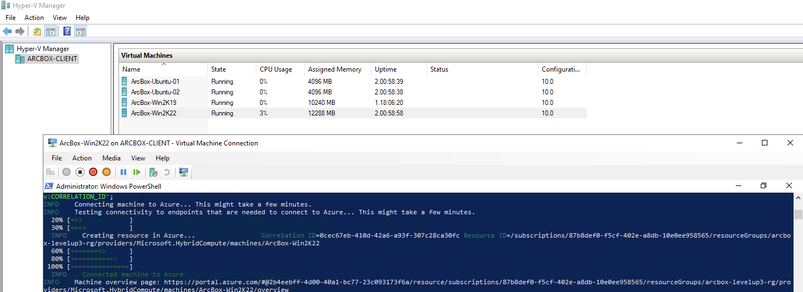

- On successful completion a message is displayed to confirm the machine is connected to Azure Arc. We can also verify that our Windows machine is connected in the Azure portal (Machines - Azure Arc).

    

- **Optional**: Repeat the process to onboard the ArcBox-Ubuntu-02 VM

- From Hyper-V manager click on the ArcBox-Ubuntu-02 VM and navigate to the Networking tab to find its IP-address


- Start Windows Terminal from the desktop-shortcut and connect to the ArcBox-Ubuntu-02 VM via SSH
```shell
ssh jumpstart@10.10.1.104
```
- Password is JS123!!
- Since the nested VM is running in Azure, we need to block access to the Azure IMDS endpoint for the installer to not detect it is running in an Azure VM (only supported for evaluation purposes). Paste and run the following commands:

```shell
sudo ufw --force enable
sudo ufw deny out from any to 169.254.169.254
sudo ufw default allow incoming
```

- Copy the content of the onboarding script generated in the portal into the terminal.
- After successful execution, verify that the ArcBox-Ubuntu-02 is listed in the Azure portal as an Arc-enabled Server.

For more information about deployment options, see the following two articles:
- [Azure Connected Machine agent deployment options](https://learn.microsoft.com/azure/azure-arc/servers/deployment-options)
- [Connect hybrid machines to Azure at scale](https://learn.microsoft.com/azure/azure-arc/servers/onboard-service-principal).

### Module 2: Query and inventory your Azure Arc-enabled servers using Azure Resource Graph

#### Objective

In this module, you will learn how to use the Azure Resource queries both in the Azure Graph Explorer and Powershell to demonstrate inventory management of your Azure Arc connected servers. Note that the results you get by running the graph queries in this module might be different from the sample screenshots as your environment might be different.

#### Task 1: Apply resource tags to Azure Arc-enabled servers

In this first step, you will assign Azure resource tags to some of your Azure Arc-enabled servers. This gives you the ability to easily organize and manage server inventory.

- Enter "Machines - Azure Arc" in the top search bar in the Azure portal and select it from the displayed services.

    

- Click on the Windows 2019 Azure Arc-enabled server.

    

- Click on "Tags". Add a new tag with Name="Scenario” and Value="azure_arc_servers_inventory”. Click Apply when ready.

    

- Repeat the same process in other Azure Arc-enabled servers if you wish. This new tag will be used later when working with Resource Graph Explorer queries.

#### Task 2: The Azure Resource Graph Explorer

- Now, we will explore our hybrid server inventory using a number of Azure Graph Queries. Enter "Resource Graph Explorer" in the top search bar in the Azure portal and select it.

    

- The scope of the Resource Graph Explorer can be set as seen below

    

#### Task 3: Run a query to show all Azure Arc-enabled servers in your subscription

- In the query window, enter and run the following query and examine the results which should show your Arc-enabled servers. Note the use of the KQL equals operator (=~) which is case insensitive [KQL =~ (equals) operator](https://learn.microsoft.com/azure/data-explorer/kusto/query/equals-operator).

    ```shell
    resources
    | where type =~ 'Microsoft.HybridCompute/machines'
    ```

    

- Scroll to the right on the results pane and click "See Details" to see all the Azure Arc-enabled server metadata. Note for example the list of detected properties, we will be using these in the next task.

- You can also run the same query using PowerShell providing that you have added the required module "Az.ResourceGraph" as explained in [Run your first Resource Graph query using Azure PowerShell](https://learn.microsoft.com/azure/governance/resource-graph/first-query-powershell#add-the-resource-graph-module).

The module is pre-installed on the ArcBox-Client VM. For your information, this is the command to install the PowerShell module:

  ```powershell
  Install-Module -Name Az.ResourceGraph
  ```

Then open Windows Terminal from the desktop shortcut and run the following query in PowerShell

  ```powershell
  Search-AzGraph -Query "resources | where type =~ 'Microsoft.HybridCompute/machines'"
  ```

#### Task 4: Query your server inventory using the available metadata

- Use PowerShell and the Resource Graph Explorer to summarize the server count by "logical cores" which is one of the detected properties referred to in the previous task. Remember to only use the query string, which is enclosed in double quotes, if you want to run the query in the portal.

    ```powershell
    Search-AzGraph -Query "resources
    | where type =~ 'Microsoft.HybridCompute/machines'
    | extend logicalCores = tostring(properties.detectedProperties.logicalCoreCount), operatingSystem = tostring(properties.osType)
    | summarize serversCount =count() by logicalCores,operatingSystem"
    ```

- The Graph Explorer allows you to get a graphical view of your results by selecting the "charts" option.

    

#### Task 5: Use the resource tags in your Graph Query

- Let’s now build a query that uses the tag we assigned earlier to some of our Azure Arc-enabled servers. Use the following query that includes a check for resources that have a value for the "Scenario" tag. Feel free to use the portal or PowerShell. Check that the results match the servers that you set tags for earlier.

    ```powershell
    Search-AzGraph -Query "resources
    | where type =~ 'Microsoft.HybridCompute/machines' and isnotempty(tags['Scenario'])
    | extend Scenario = tags['Scenario']
    | project name, tags"
    ```

#### Task 6: List the extensions installed on the Azure Arc-enabled servers

- Run the following advanced query which allows you to see what extensions are installed on the Arc-enabled servers. Notice that running the query in PowerShell requires us to escape the $ character as explained in [Escape Characters](https://learn.microsoft.com/azure/governance/resource-graph/concepts/query-language#escape-characters).

    ```powershell
    Search-AzGraph -Query "resources
    | where type == 'microsoft.hybridcompute/machines'
    | project id, JoinID = toupper(id), ComputerName = tostring(properties.osProfile.computerName), OSName = tostring(properties.osName)
    | join kind=leftouter(
        resources
        | where type == 'microsoft.hybridcompute/machines/extensions'
        | project MachineId = toupper(substring(id, 0, indexof(id, '/extensions'))), ExtensionName = name) on `$left.JoinID == `$right.MachineId
    | summarize Extensions = make_list(ExtensionName) by id, ComputerName, OSName
    | order by tolower(OSName) desc"
    ```

- If you have used the portal to run the query then you should remove the escape from the $ character ($left.JohnID and $right.MachinID) before running the query as shown in the screenshot below.

    

#### Task 7: Query other properties

- Azure Arc provides additional properties on the Azure Arc-enabled server resource that we can query with Resource Graph Explorer. In the following example, we list some of these key properties, like the Azure Arc Agent version installed on your Azure Arc-enabled servers

    ```powershell
    Search-AzGraph -Query  "resources
    | where type =~ 'Microsoft.HybridCompute/machines'
    | extend arcAgentVersion = tostring(properties.['agentVersion']), osName = tostring(properties.['osName']), osVersion = tostring(properties.['osVersion']), osSku = tostring(properties.['osSku']),
    lastStatusChange = tostring(properties.['lastStatusChange'])
    | project name, arcAgentVersion, osName, osVersion, osSku, lastStatusChange"
    ```

- Running the same query in the portal should result in something like the following

    

#### Task 8: Copilot for Azure Arc

- Go to the Azure portal and naviagte to the **Azure Arc Machines** view
- Open **Copilot for Microsoft Azure**
- Paste a prompt of your choice from the below table and press Enter

    

## Azure Arc Prompts

|Prompt | Query |
|----------|----------|
**How many windows Arc-servers do I have?** | resources<br>\| where type =~ 'microsoft.hybridcompute/machines' and properties.osType=="windows"<br>\| count |
**How many linux Arc-servers do I have?** | resources<br>\| where type =~ 'microsoft.hybridcompute/machines' and properties.osType=="linux"<br>\| count |
**How many of my Arc servers are connected?** | resources<br>\| where type =~ 'microsoft.hybridcompute/machines' and properties.status=="Connected"<br>\| count |
**How many of my Arc servers are disconnected?** | resources<br>\| where type =~ 'microsoft.hybridcompute/machines' and properties.status=="Disconnected"<br>\| count |
**What is the distribution of my Arc machines by status?** | resources<br>\| where type =~ 'microsoft.hybridcompute/machines'<br>\| summarize count() by tostring(properties.status) |
**What is the distribution of my Arc machines by os?** | resources<br>\| where type =~ 'microsoft.hybridcompute/machines'<br>\| summarize count() by tostring(properties.osType) |
**How many Arc servers do not have automatic agent upgrade turned on?** | resources<br>\| where type =~ 'microsoft.hybridcompute/machines' and properties.agentUpgrade.enableAutomaticUpgrade==false<br>\| count |
**How many Arc servers have an esu license?** | resources<br>\| where type =~ 'microsoft.hybridcompute/machines' and properties.licenseProfile.esuProfile.licenseAssignmentState=="Assigned"<br>\| count |
**How many Arc machines are eligibile for esu but do not have an esu applied?** | resources<br>\| where type =~ 'microsoft.hybridcompute/machines' and properties.licenseProfile.esuProfile.licenseAssignmentState!="Assigned"<br>and properties.licenseProfile.esuProfile.esuEligibility=="Eligible"<br>\| count |
**What extensions are configured for this Arc server?** | resources<br>\| where ['type'] == "microsoft.hybridcompute/machines/extensions" and id contains "ServerName"<br>\| distinct name |
**How many of my Arc servers have the azure monitoring agent installed?** | resources<br>\| where ['type'] == "microsoft.hybridcompute/machines/extensions" and (name == "AzureMonitorWindowsAgent" or name == "AzureMonitorLinuxAgent")<br>\| distinct id<br>\| count |
**How many of my Arc servers have failed extensions?** | resources<br>\| where ['type'] == "microsoft.hybridcompute/machines/extensions" and properties.provisioningState=="Failed"<br>\| parse id with resourceId "/extensions" *<br>\| distinct resourceId<br>\| count |

- Repeat and try out a couple more prompts you might find useful


### Module 3: SSH into your Azure Arc-enabled servers using SSH access

#### Objective

Enable SSH based connections to Arc-enabled servers without requiring a public IP address or additional open ports.

In this module, you will learn how to enable and configure this functionality. At the end, you will interactively explore how to access to Arc-enabled Windows and Linux machines.

#### Task 1: Install prerequisites on client machine

It is possible to leverage both Azure CLI and Azure PowerShell to connect to Arc-enabled servers. Choose the one to use based on your own preferences.

1. RDP into the _ArcBox-Client_ VM.

2. Open PowerShell and install either the Azure CLI extension or the Azure PowerShell modules based on your preference of tooling.

##### Azure CLI

  ```shell
  az extension add --name ssh
  ```

or

##### Azure PowerShell

  ```PowerShell
  Install-PSResource -Name Az.Ssh -TrustRepository
  Install-PSResource -Name Az.Ssh.ArcProxy -TrustRepository
  ```

  > We recommend that you install the tools on the ArcBox Client virtual machine, but you may also choose to use your local machine if you want to verify that the Arc-enabled servers is reachable from any internet-connected machine after performing the tasks in this module.

#### Task 2 - Enable SSH service on Arc-enabled servers

>We will use two Arc-enabled servers running in ArcBox for this module:

- _ArcBox-Win2K25_
- _ArcBox-Ubuntu-01_

1. RDP into the _ArcBox-Client_ VM

2. Open Hyper-V Manager

3. Right click _ArcBox-Win2K25_ and select Connect twice

4. Login to the operating system using username Administrator and the password you used when deploying ArcBox, by default this is **JS123!!**

5. Open Windows PowerShell or PowerShell 7 and run the following to check if the SSH service is already installed

 ```PowerShell
Get-Service sshd
```

6. If step 5 shows no output, install OpenSSH for Windows by running the following:

  ```PowerShell
  # Install the OpenSSH Server
  Add-WindowsCapability -Online -Name OpenSSH.Server~~~~0.0.1.0

  # Start the sshd service
  Start-Service sshd

  # Configure the service to start automatically
  Set-Service -Name sshd -StartupType 'Automatic'

  # Confirm the Windows Firewall is configured to allow SSH. The rule should be created automatically by setup. Run the following to verify:
  if (!(Get-NetFirewallRule -Name "OpenSSH-Server-In-TCP" -ErrorAction SilentlyContinue | Select-Object Name, Enabled)) {
      Write-Output "Firewall Rule "OpenSSH-Server-In-TCP" does not exist, creating it..."
      New-NetFirewallRule -Name "OpenSSH-Server-In-TCP" -DisplayName "OpenSSH Server (sshd)" -Enabled True -Direction Inbound -Protocol TCP -Action Allow -LocalPort 22
  } else {
      Write-Output "Firewall rule 'OpenSSH-Server-In-TCP' has been created and exists."
  }
  ```

6. Close the connection to _ArcBox-Win2K25_

7. Right click _ArcBox-Ubuntu-01_ in Hyper-V Manager and select Connect

8. Login to the operating system using username **jumpstart** and the password you used when deploying,  by default this is **JS123!!**

9. Run the command `systemctl status sshd` to verify that the SSH service is active and running

10. Close the connection to _ArcBox-Ubuntu-01_

#### Task 3 - Connect to Arc-enabled servers

1. From the _ArcBox-Client_ VM, open a PowerShell session in Windows Terminal and use the below commands to connect to **ArcBox-Ubuntu-01** using SSH:

##### Azure CLI

  ```shell
    $serverName = "ArcBox-Ubuntu-01"
    $localUser = "jumpstart"

    az ssh arc --resource-group $Env:resourceGroup --name $serverName --local-user $localUser
  ```
or

##### Azure PowerShell

  ```PowerShell
  $serverName = "ArcBox-Ubuntu-01"
  $localUser = "jumpstart"
  Enter-AzVM -ResourceGroupName $Env:resourceGroup -Name $serverName -LocalUser $localUser
  ```

2. The first time you connect to an Arc-enabled server using SSH, you might see the following prompt:

> Port 22 is not allowed for SSH connections in this resource. Would you like to update the current Service Configuration in the endpoint to allow connections to port 22? If you would like to update the Service Configuration to allow connections to a different port, please provide the -Port parameter or manually set up the Service Configuration. (y/n)

3. It is possible to pre-configure this setting on the Arc-enabled servers by following the steps in the section *Enable functionality on your Arc-enabled server* in the [documentation](https://learn.microsoft.com/azure/azure-arc/servers/ssh-arc-overview?tabs=azure-powershell#getting-started). However, for this exercise, type `yes` and press Enter to proceed.

    

    

4. Following the previous method, connect to _ArcBox-Win2K22_ via SSH.

##### Azure CLI

  ```shell
  $serverName = "ArcBox-Win2K25"
  $localUser = "Administrator"
  az ssh arc --resource-group $Env:resourceGroup --name $serverName --local-user $localUser
  ```

or
##### Azure PowerShell

  ```PowerShell
  $serverName = "ArcBox-Win2K25"
  $localUser = "Administrator"
  Enter-AzVM -ResourceGroupName $Env:resourceGroup -Name $serverName -LocalUser $localUser
  ```

  

  

5. In addition to SSH, you can also connect to the Azure Arc-enabled servers, Windows Server virtual machines using **Remote Desktop** tunneled via SSH.

##### Azure CLI

  ```shell
  $serverName = "ArcBox-Win2K25"
  $localUser = "Administrator"
  az ssh arc --resource-group $Env:resourceGroup --name $serverName --local-user $localUser --rdp
  ```

or

##### Azure PowerShell

  ```PowerShell
  $serverName = "ArcBox-Win2K25"
  $localUser = "Administrator"
  Enter-AzVM -ResourceGroupName $Env:resourceGroup -Name $serverName -LocalUser $localUser -Rdp
  ```

  

##### Task 4 - Optional: Microsoft Entra ID based SSH Login

1. The _Azure AD based SSH Login – Azure Arc VM extension_ can be added from the extensions menu of the Arc server in the Azure portal. The Azure AD login extension can also be installed locally via a package manager via: `apt-get install aadsshlogin` or the following command:

  ```shell
  $serverName = "ArcBox-Ubuntu-01"
  az connectedmachine extension create --machine-name $serverName --resource-group $Env:resourceGroup --publisher Microsoft.Azure.ActiveDirectory --name AADSSHLogin --type AADSSHLoginForLinux --location $env:azureLocation
  ```

2. Verify role assignments for the Arc-enabled server _ArcBox-Ubuntu-01_ by using the Azure portal and navigating to the Access control menu option for that machine.  Two Azure roles are used to authorize VM login:
    - **Virtual Machine Administrator Login**: Users who have this role assigned can log in to an Azure virtual machine with administrator privileges.
    - **Virtual Machine User Login**: Users who have this role assigned can log in to an Azure virtual machine with regular user privileges.

>Note: The assignment of **Virtual Machine Administrator Login** is already performed for you in the lab environment, but you should verify this before proceeding.

3. After verifying that one of the two roles for your personal Entra ID lab user has been assigned, run the following command to connect to _ArcBox-Ubuntu-01_ using SSH and AAD/Entra ID-based authentication:

#### Azure CLI

  ```shell
  # Log out from the Service Principal context
  az logout

  # Log in using your personal account
  az login

  $serverName = "ArcBox-Ubuntu-01"

  az ssh arc --resource-group $Env:resourceGroup --name $serverName
  ```

or

#### Azure PowerShell

  ```PowerShell
  # Log out from the Service Principal context
  Disconnect-AzAccount

  # Log in using your personal account
  Connect-AzAccount
  $serverName = "ArcBox-Ubuntu-01"

  Enter-AzVM -ResourceGroupName $Env:resourceGroup -Name $serverName
  ```

4. You should now be connected and authenticated using your Azure AD/Entra ID account.

### Module 4: Monitor your Azure Arc-enabled servers using Azure Monitor

#### Objective

In this module, you will learn how to deploy the Azure Monitor agent to your Arc-enabled Windows and Linux machines, how to deploy the dependency agent to your Arc-enabled Windows machines, how to enable the _VM Insights_ solution to start monitoring your machines using Azure Monitor, how to run queries on the Log analytics workspace and how to configure alerts.

#### Task 1: Monitor your Arc-enabled servers' performance using VMInsights

As part of the automation, we deploy the Azure Monitor Agents to the Windows and Linux machines, data collection rule for VMInsights and configure the VMInsight solution for you.

- Enter "Machines - Azure Arc" in the top search bar in the Azure portal and select it from the displayed services.

    

- Click on the Windows 2019 Azure Arc-enabled **Windows** servers.

    

- Click on the **Extensions** tab to validate the installation of the Azure Monitor Agent extension successful deployment.

    

> Note: The Dependency Agent is not supported on Ubuntu 22.04

- Click on the **Insights** tab to view the different metrics of your servers.

    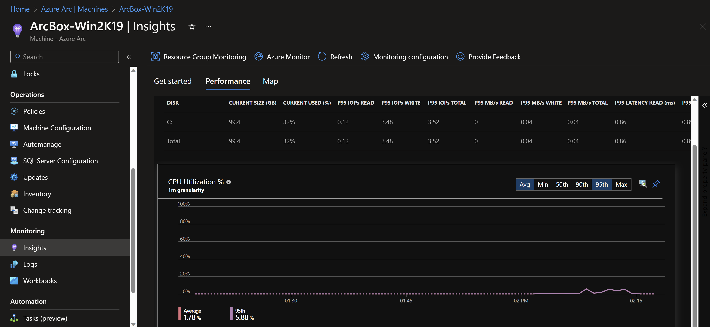

- Explore also the **Dependency map solution** to view the different connections the Arc-enabled server is making.

    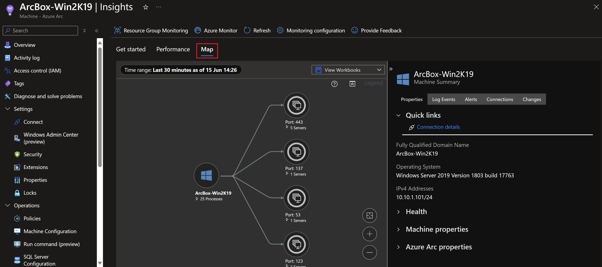

#### Task 2: Configure data collection for logs and metrics

As part of the ArcBox automation, some alerts and workbooks have been created to demonstrate the different monitoring operations you can perform after onboarding the Arc-enabled machines. You will now configure some data collection rules to start sending the needed metrics and logs to the Log Analytics workspace.

- In the Azure portal, search for _Data Collection rules_.

    

- Create a new data collection rule.

    

- Provide a name and select the same resource group where ArcBox is deployed. Make sure to select Windows as the operating system.

    

- In the "Resources" tab, select the right resource group and the Arc-enabled servers onboarded.

    

- Add a new "Performance Counters" data source, and make sure to select all the custom counters.

    

- Add a new "Azure Monitor Logs" destination and select the log analytics workspace deployed in the ArcBox resource group and save.

    

- Add a new "Windows Event logs" data source.

    

- Select _Critial_, _Error_ and _Warning_ events in the Application and System logs and add the data source.

    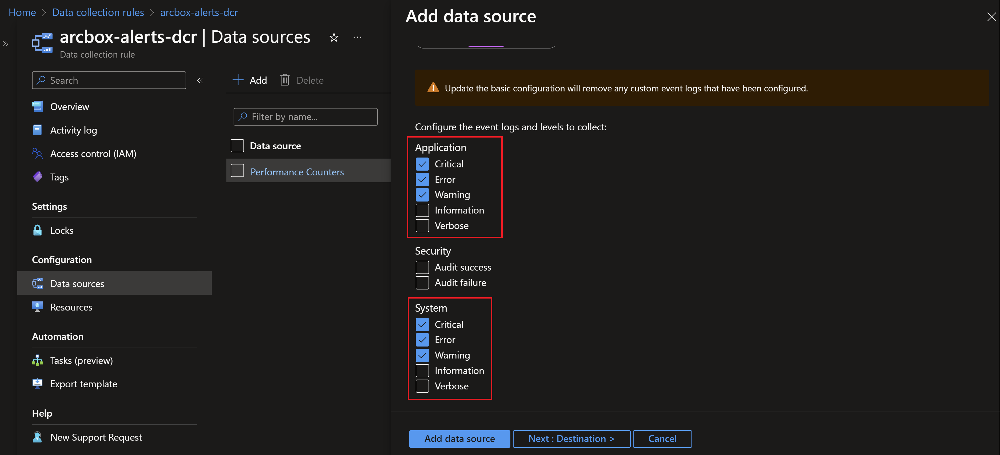

- Save and create the data collection rule.

- [Optional]Repeat the previous steps to create another Linux data collection rule.

    

    

    

- After waiting for 5-10 minutes for the data collection rule to start collecting data, restart the servers in the Hyper-V manager on the _ArcBox-Client_ VM to trigger some new events.

    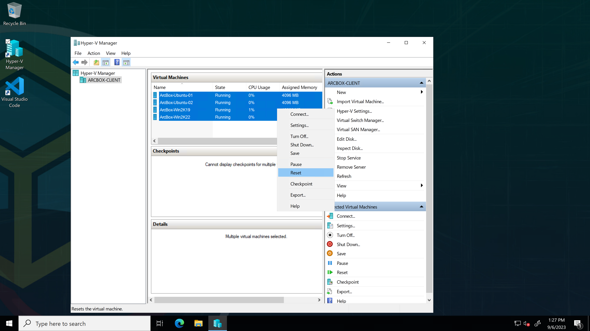

#### Task 3: View alerts and visualizations

**NOTE: It might take some time for all visualizations to load properly**

- In Azure Monitor, click on _Alerts_. and select _Alert rules_

    

- Explore the alert rules created for you.

    

- Go back to Azure Monitor and click on _Workbooks_. There are three workbooks deployed for you.

    

    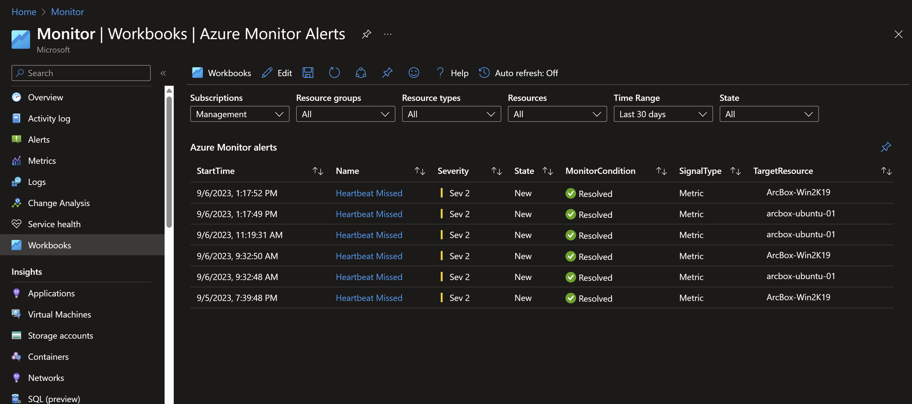

    

    

### Module 5: Keep your Azure Arc-enabled servers patched using Azure Update Manager

#### Objective

Azure Update Manager is the new service that unifies all VMs running in Azure together with Azure Arc, putting all update tasks in 1 common area for all supported Linux and Windows versions.
This service is NOT dependent on Log analytics agent. (The older Azure Automation Update service relies on Log Analytics agent)

In this module, you will setup Azure update manager and learn how to enable it to efficiently manage all updates for your machines, regardless of where they are. You will also see some of the default reports using workbooks to monitor your Azure update manager environment.

#### Task 1: Use the Azure portal and search for Azure Update manager

- Click on "Machines" in the left blade to view all your Azure machines.

Note that all the Azure VMs and Arc-enabled server that are already visible in this Azure Update Manager service.

   

- Select the Arc-enabled machines and click on the refresh button to refresh the current status of selected VMs.

   

- **Optional** - you can enable automatic recurring task for at scale refresh once every 24 hours.

   Select the Arc-enabled servers, click on settings then choose update settings, and set the periodic assessement drop down to enable.

  Note that the rest of the VMs will automatically be enabled.

   

#### Task 2: Create a maintenance configuration from Azure update manager.

- Click on Maintenance configuration in the top of the screen as shown below

   

- Fill out the basics tab as shown below, make sure you choose a region based on your location. Leave the rest as default.

   

- **Optional** click on dynamic scopes, then the subscriptions where your Arc-enabled machines are, select "filter by" option and choose how machines are added to this maintenance configuration (by OS, location, resource group)

In this guide, we filtered by the OS type as shown below.

   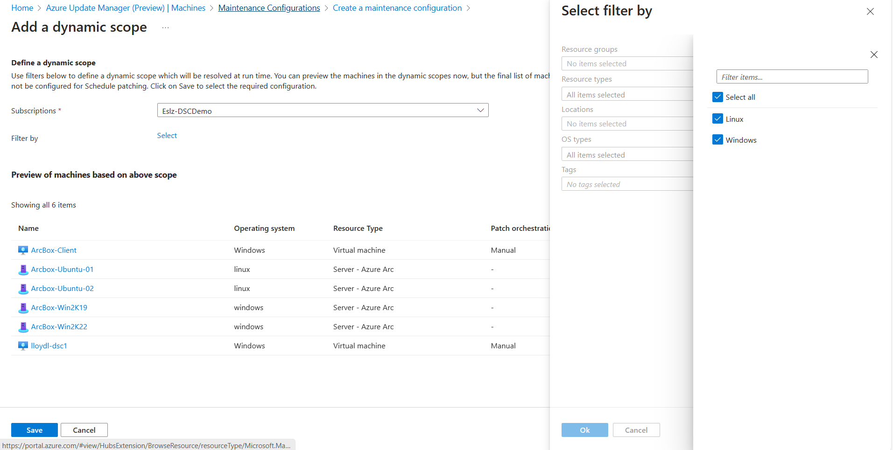

>**Note**: If you want to enable dynamic scopes, you will need to enable the "Dynamic Scoping" preview feature in the subscription.

   

- Click on the machines tab to choose machines specifically instead of dynamically.

   

- Click on the updates tab to choose what type of updates will be installed by this config as shown below.

   

#### Task 3: Apply one-time updates from Azure update manager

 Instead of using maintenance configs with specific recurring cycles, you can also setup one-time updates (immediately!). Start by forcing an immediate refresh.

- Select your Arc-enabled machines, select "One-time update" from the top menu.

   

- Click on the updates tab and select updates of your choice to apply to your machines.

   

- Click on the properties tab and select "reboot if required" and "60 minutes" for the Maintenance window.

   

- After updates have been applied and the machines rebooted, you can see the status of the machines.

   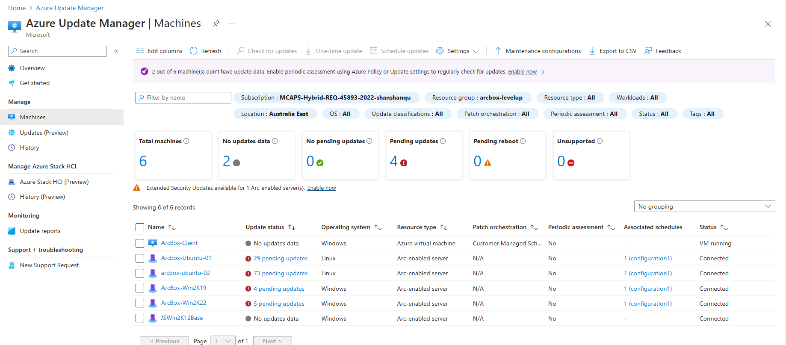

#### Task 4: Explore the Azure update manager Overview workbook.

Under the Monitoring part of the Update Manager, there is a default workbook, which is an overview of the Azure Update Manager. There are a few views in there that show the total number of machines connected, history of runs, and the status.

- In Azure update manager, click on "update reports" under Monitoring.

   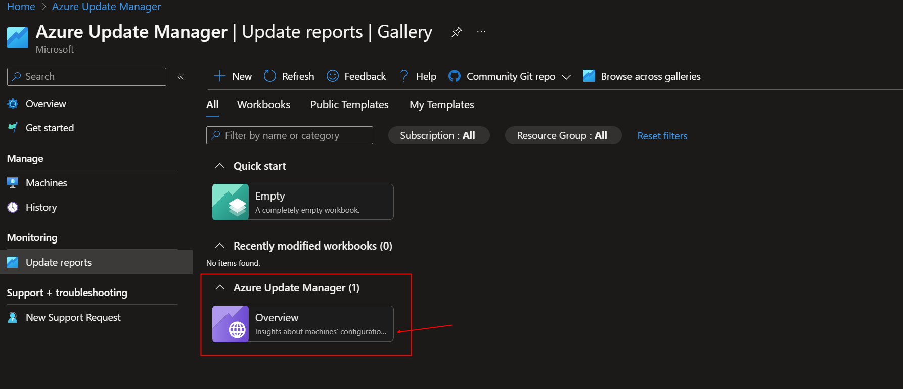

- Select on the subscription that has your Azure Arc-enabled servers.

Note that there are a few views in there that show the total number of machines connected, history of runs, and the status.

- Expand the "Machines overall status & configurations" view of currently connected machines, split by Azure and Azure Arc VMs, and Windows and Linux numbers. Notice the View of manual vs periodic assessments and manual vs automatically updated

   

   

- Expand the "Updates Data Overview" view and look at the updates by classification

   

Expand the rest of the views "Schedules/maintenance configurations" and "History of installation runs" to visualize the updates running in Azure Update manager.

### Module 6: Manage your Arc-enabled Windows machines using the Windows Admin Center

#### Objective

In this module you will learn how to use the Windows Admin Center in the Azure portal to manage the Windows operating system of your Arc-enabled servers, known as hybrid machines. You can securely manage hybrid machines from anywhere without needing a VPN, public IP address, or other inbound connectivity to your machine.

#### Task 1: Pre-requisites

Pre-requisite: Azure permissions

- The Windows Admin Center extension is already installed for you on the Arc-enabled machines.

- Connecting to Windows Admin Center requires you to have Reader and Windows Admin Center Administrator Login permissions at the Arc-enabled server resource. The following steps helps you to set these up.

- Enter "Machines - Azure Arc" in the top search bar in the Azure portal and select it from the displayed services.

    

- Click on the Windows 2019 Azure Arc-enabled **Windows** server.

> Note: The Windows 2025 machine can also be used


>Note: The assignment of **Admin Center Administrator Login** is already performed for you in the lab environment, but you should verify this before proceeding.

- From the selected Windows machine click "Access control (IAM)" then verify that the role "Admin Center Administrator Login" is assigned to your lab user.

    

- From the selected Windows machine, navigate to the Licences -> Windows Server menu blade, mark the checkbox "Activate Azure benefits" and press the Confirm-button.

    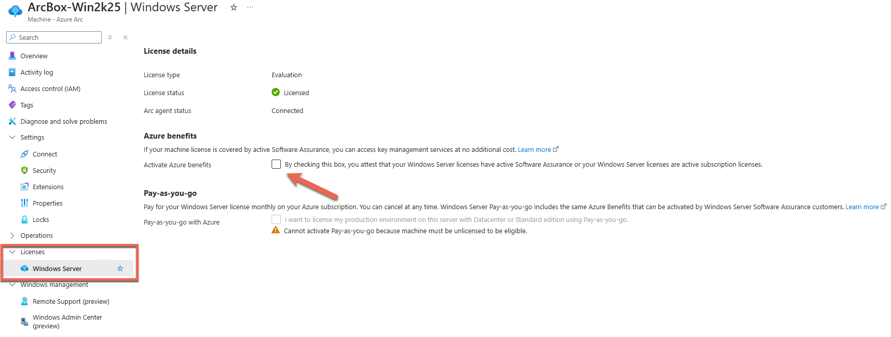


#### Task 2: Connect and explore Windows Admin Center (preview)

- Once the role assignment is complete and Azure benefits is enabled you can connect to the Windows Admin Center.

    

- Start exploring the capabilities offered by the Windows Admin Center to manage your Arc-enabled Windows machine.

    

- Let us use the Windows Admin Center to add a local user, a new group and assign the new user to the new group. From the left menu select "Local users & groups". Then from the "Users" tab click "New user". Enter the user details and click on "Submit". Verify that the user has been added.

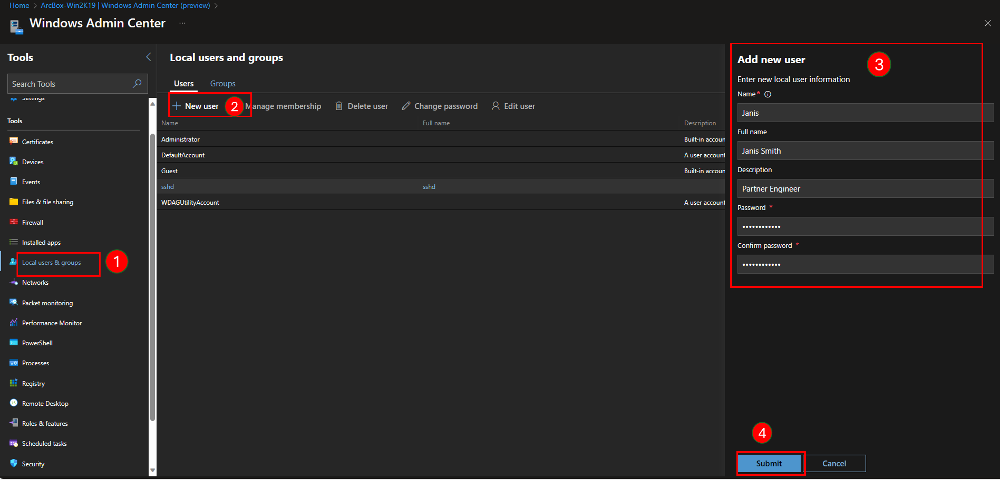

- Now select the "Groups" tab and click on "New Group". Enter the group details and click on "Submit". Verify that the group has been added.

    

- Back to the "Users" tab, select the new user you have added, then click "Manage membership". Add the selected user to the new group and save.

    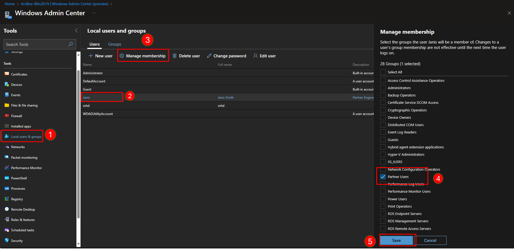

### Module 7: Configure your Azure Arc-enabled servers to use Arc Gateway

#### Objective

In this module, you will learn to configure an existing Arc-enabled Server to use Arc Gateway.

#### Task 1: Associate Arc-enabled Server to Arc Gateway

- Verify the existing connection details for ArcBox-Win2k25
  - On the ArcBox Client VM, open Hyper-V Manager and connect to the machine using the password **JS123!!*
  - Right click on the Start-menu inside the VM and select **Terminal**
  - Type `azcmagent show` and press enter
    - 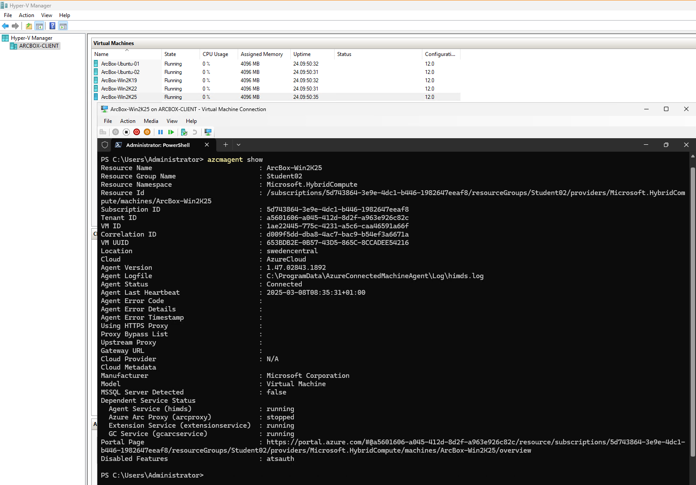

- Navigate to Azure Arc in the Azure Portal and find the shared Arc gateway to use for this task:
  - 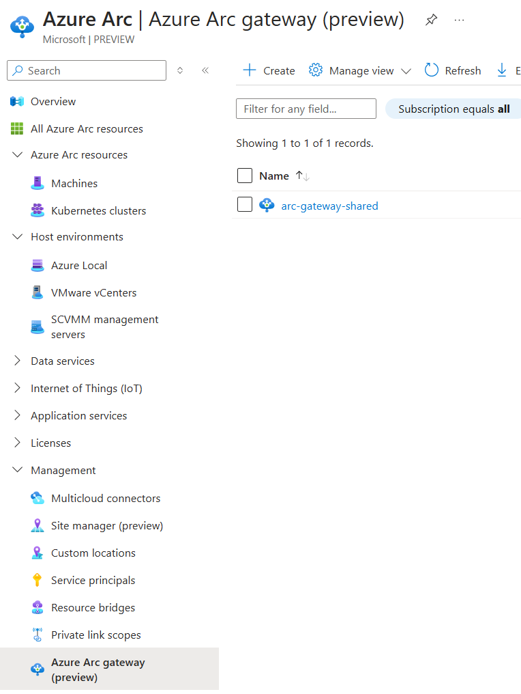
- Click on **arc-gateway-shared** and go to **Associated resources** and click **Add**
  - Select the ArcBox-Win2k25 machine and click **Apply**
  - 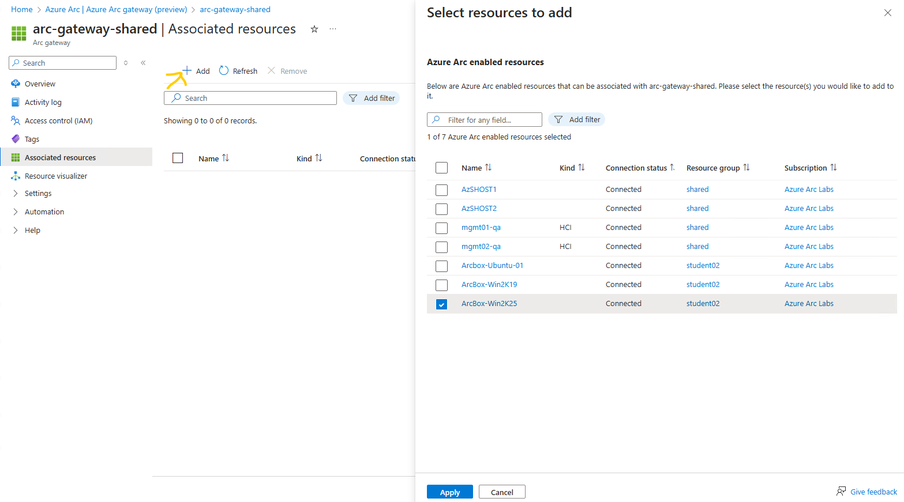
- Update the Arc-enabled server to use Arc gateway by running `azcmagent config set connection.type gateway` in the Terminal window
  - 
- Re-run the following command: `azcmagent show`
  - 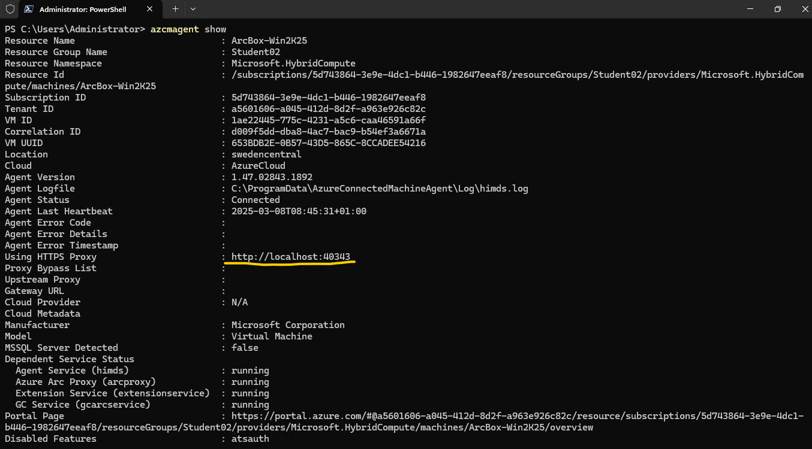
- Run the following command: `azcmagent check`
  - 

The result should indicate that the connection.type is set to **gateway**, and the **Reachable** column should indicate true for all URLs.

Review the [Arc Gateway documentation](https://learn.microsoft.com/azure/azure-arc/servers/arc-gateway?tabs=portal#how-to-use-the-arc-gateway-public-preview) to explore how the Arc Gateway is created and how to onboard new machines to use the gateway directly.

*Note: Due to the limit of 5 Arc gateway resources per subscription, this lab is using a shared gateway for all students.*

# Appendix

## Deployment

### Prerequisites

- [Install or update Azure CLI to version 2.51.0 and above](https://docs.microsoft.com/cli/azure/install-azure-cli?view=azure-cli-latest). Use the below command to check your current installed version.

  ```shell
  az --version
  ```

    

- Login to AZ CLI using the ```az login``` command.

  ```shell
  az login
  ```

If you have access to multiple tenants, use the `--tenant` switch.

  ```shell
  az login --tenant <tenantId>
  ```

- Set the default subscription using Azure CLI.

  ```shell
  $subscriptionId = "<Subscription Id>"
  az account set -s $subscriptionId
  ```

- Ensure that you have selected the correct subscription you want to deploy ArcBox to by using the ```az account list --query "[?isDefault]"``` command. If you need to adjust the active subscription used by Az CLI, follow [this guidance](https://docs.microsoft.com/cli/azure/manage-azure-subscriptions-azure-cli#change-the-active-subscription).

- ArcBox must be deployed to one of the following regions. **Deploying ArcBox outside of these regions may result in unexpected results or deployment errors.**

  - Sweden Central
  - East US
  - East US 2
  - Central US
  - West US 2
  - North Europe
  - West Europe
  - France Central
  - UK South
  - Australia East
  - Japan East
  - Korea Central
  - Southeast Asia

- **ArcBox requires 8 DSv5-series vCPUs** when deploying with default parameters such as VM series/size. Ensure you have sufficient vCPU quota available in your Azure subscription and the region where you plan to deploy ArcBox. You can use the below Az CLI command to check your vCPU utilization.

  ```shell
  az vm list-usage --location <your location> --output table
  ```

  

- Register necessary Azure resource providers by running the following commands.

  ```shell
  az provider register --namespace Microsoft.HybridCompute
  az provider register --namespace Microsoft.GuestConfiguration
  az provider register --namespace Microsoft.AzureArcData
  az provider register --namespace Microsoft.HybridConnectivity
  az provider register --namespace Microsoft.OperationsManagement
  az provider register --namespace Microsoft.SecurityInsights
  ```

- To deploy ArcBox, an Azure account assigned with the _Owner_ Role-based access control (RBAC) role is required.

    > **NOTE: The Jumpstart scenarios are designed with as much ease of use in-mind and adhering to security-related best practices whenever possible. It is optional but highly recommended to scope the access to a specific [Azure subscription and resource group](https://docs.microsoft.com/cli/azure/ad/sp?view=azure-cli-latest) as well considering using a [less privileged service principal account](https://docs.microsoft.com/azure/role-based-access-control/best-practices)**

### Deployment

#### Deployment Option 1: Azure portal

- Click the <a href="https://portal.azure.com/#create/Microsoft.Template/uri/https%3A%2F%2Fraw.githubusercontent.com%2FAzure%2Farc_jumpstart_levelup%2Farc_master_class%2Fazure_arc_servers_jumpstart%2FARM%2Fazuredeploy.json" target="_blank"></a> button and enter values for the the ARM template parameters.

  

  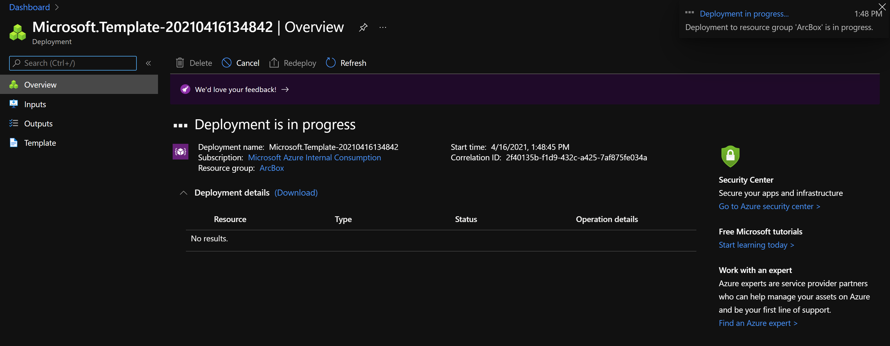

  

    > **NOTE: The deployment takes around 10 minutes to complete.**

    > **NOTE: If you see any failure in the deployment, please check the [troubleshooting guide](https://azurearcjumpstart.io/azure_jumpstart_arcbox/itpro/#basic-troubleshooting).**

### Deployment Option 2: Bicep deployment via Azure CLI

- Clone the Azure Arc Jumpstart repository

  ```shell
  $folderPath = <Specify a folder path to clone the repo>

  Set-Location -Path $folderPath
  git clone https://github.com/azure/arc_jumpstart_levelup.git
  git checkout arc_master_class
  Set-Location -Path "azure_arc\azure_jumpstart_arcbox_servers_levelup\bicep"
  ```

- Upgrade to latest Bicep version

  ```shell
  az bicep upgrade
  ```

- Edit the [main.bicepparam](https://github.com/Azure/arc_jumpstart_levelup/blob/arc_master_class/azure_arc_servers_jumpstart/bicep/main.bicepparam) template parameters file and supply some values for your environment.
  - _`spnTenantId`_ - Your Azure tenant id
  - _`windowsAdminUsername`_ - Client Windows VM Administrator name
  - _`windowsAdminPassword`_ - Client Windows VM Password. Password must have 3 of the following: 1 lower case character, 1 upper case character, 1 number, and 1 special character. The value must be between 12 and 123 characters long.
  - _`logAnalyticsWorkspaceName`_ - Unique name for the ArcBox Log Analytics workspace
  - _`emailAddress`_ - Your email address, to configure alerts for the monitoring action group

Example parameters-file:

  

- Now you will deploy the Bicep file. Navigate to the local cloned [deployment folder](https://github.com/Azure/arc_jumpstart_levelup/blob/arc_master_class/azure_arc_servers_jumpstart/bicep) and run the below command:

  ```shell
  az group create --name "<resource-group-name>" --location "<preferred-location>"
  az deployment group create -g "<resource-group-name>" -f "main.bicep" -p "main.bicepparam"
  ```

    > **NOTE: If you see any failure in the deployment, please check the [troubleshooting guide](https://azurearcjumpstart.io/azure_jumpstart_arcbox/itpro/#basic-troubleshooting).**

    > **NOTE: The deployment takes around 10 minutes to complete.**

### Connecting to the ArcBox Client virtual machine

Various options are available to connect to _ArcBox-Client_ VM, depending on the parameters you supplied during deployment.

- [RDP](https://azurearcjumpstart.io/azure_jumpstart_arcbox/ITPro/#connecting-directly-with-rdp) - available after configuring access to port 3389 on the _ArcBox-NSG_, or by enabling [Just-in-Time access (JIT)](https://azurearcjumpstart.io/azure_jumpstart_arcbox/ITPro/#connect-using-just-in-time-accessjit).
- [Azure Bastion](https://azurearcjumpstart.io/azure_jumpstart_arcbox/ITPro/#connect-using-azure-bastion) - available if ```true``` was the value of your _`deployBastion`_ parameter during deployment.

#### Connecting directly with RDP

By design, ArcBox does not open port 3389 on the network security group. Therefore, you must create an NSG rule to allow inbound 3389.

- Open the _ArcBox-NSG_ resource in Azure portal and click "Add" to add a new rule.

  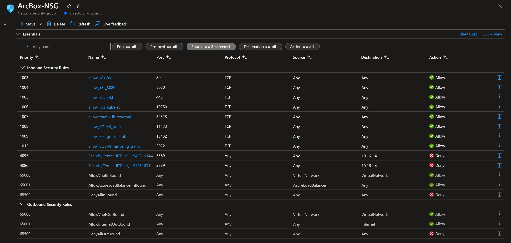

  

- Specify the IP address that you will be connecting from and select RDP as the service with "Allow" set as the action. You can retrieve your public IP address by accessing [https://icanhazip.com](https://icanhazip.com) or [https://whatismyip.com](https://whatismyip.com).

  

  

  

#### Connect using Azure Bastion

- If you have chosen to deploy Azure Bastion in your deployment, use it to connect to the VM.

  

  > **NOTE: When using Azure Bastion, the desktop background image is not visible. Therefore some screenshots in this guide may not exactly match your experience if you are connecting to _ArcBox-Client_ with Azure Bastion.**

#### The Logon scripts

- Once you log into the _ArcBox-Client_ VM, multiple automated scripts will open and start running. These scripts usually take 10-20 minutes to finish, and once completed, the script windows will close automatically. At this point, the deployment is complete.

  

- Deployment is complete! Let's begin exploring the features of Azure Arc-enabled servers with the lab modules.

  

  