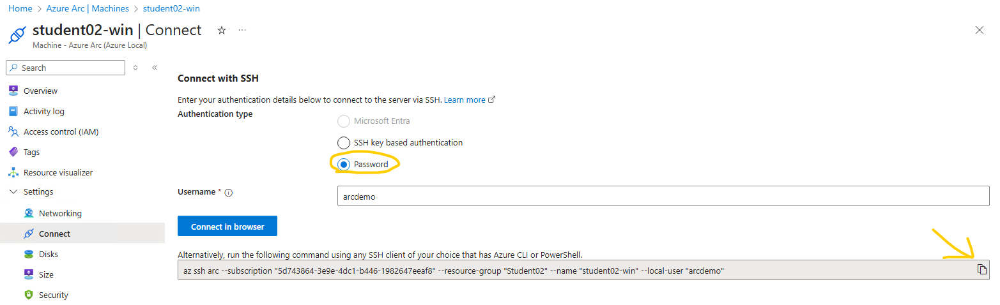

# Lab track 2 - Azure Local

## Goals

After completion of this session, you will be able to:

- Use the Azure Portal and Windows Admin Center to manage an Azure Local cluster
- Create Azure Arc-enabled servers running on Azure Local

| Module |
|---------------|
|[**1 - Explore Azure Local administrative tools**](#module-1-explore-azure-local-administrative-tools) |
|[**2 - Create Azure Arc-enabled servers running on Azure Local**](#module-2-create--azure-arc-enabled-servers-running-on-azure-local) |

## Lab Environment

The lab environment is setup using the Arc Jumpstart scenario HCIBox, which is intended for users who want to experience Azure Local capabilities in a sandbox environment.

The following diagram shows the layout of the lab environment.


## Modules

### Module 1: Explore Azure Local administrative tools

#### Objective

The objective of this module is to familiarize you with the administrative tools available in Azure Local. You will learn how to navigate and utilize the Azure Portal and Windows Admin Center to manage your Azure Local cluster and Arc-enabled servers.

##### Task 1: Use the Azure portal to examine your Azure Local environment

1. **Log in to the Azure Portal**:
   - Open your web browser and navigate to the [Azure Portal](https://portal.azure.com).
   - Enter your student-credentials to log in.

2. **Navigate to Azure Arc**:
   - In the search bar, search for and select **Azure Arc**.
   - Under **Azure Arc**, expand **Host environments**, select **Azure Local** and navigate to the tab **All systems** to view the list of Azure Local systems available.

3. **Examine the Azure Local environment**:
   - Click on the Azure Local system named **hciboxcluster**
   - Explore the information in the tabs **Properties**, **Get started**, **Monitoring** and **Capabilities**
   - Expand **Infrastructure** in the menu on the left hand-side and select **Machines**
   - You will see a list of (normally physical) servers that are part of your Azure Local environment.
   - Click on any server to view its details, including its status, operating system, and manufacturer.
   - Explore the different options in the menu on the left hand-side such as **Extensions**.
       - The extensions pre-fixed **AzureEdge** are essential extensions for Azure Local to handle various aspects such as deployments and upgrades.

4. **Use the Windows Admin Center**:
   - By having Windows Admin Center integrated with Azure, you can use it to manage your Azure Local cluster from anywhere.
   - Navigate to the Azure Local system named **hciboxcluster**, expand **Settings** and select **Windows Admin Center** from the Azure Portal and connect to your Azure Local cluster.
   - Explore the various management tools available in Windows Admin Center to manage your servers and clusters.

By completing this task, you will gain a better understanding of how to use the Azure Portal and Windows Admin Center to manage your Azure Local environment.

### Module 2: Create Azure Arc-enabled servers running on Azure Local

### Objective

The objective of this module is to guide you through the process of creating Azure Arc-enabled servers running on Azure Local. You will learn how to use the Azure Portal to provision and configure virtual machines in your Azure Local environment.

### Task 1: Create a virtual machine

1. **Log in to the Azure Portal**:
   - Open your web browser and navigate to the [Azure Portal](https://portal.azure.com).
   - Enter your student-credentials to log in.

2. **Navigate to Azure Arc**:
   - In the left-hand menu, select **Azure Arc**.

3. **Add a new server**:
   - There are two ways to access virtual machine provisioning on Azure Local in the Azure portal - you can select either one
       1) Under **Azure Arc resources**, select **Machines**.
           - Click on **+ Add/Create** and select **Create a machine in a connected host environment**.
 
   - Under **Azure Arc**, expand **Host environments**, select **Azure Local** and navigate to the tab **All systems** to view the list of Azure Local systems available.
       - Click on the Azure Local system named **hciboxcluster**
       - Expand **Resources** in the menu on the left hand-side, click **Virtual machines** and select **Create VM**
   - 

4. **Configure the virtual machine**:
   - Fill in the required details for your virtual machine:
     - **Subscription**: Select the subscription **Azure Arc Labs**
     - **Resource Group**: Select your resource group (**StudentXX**)
     - **Name**: Enter a name for your virtual machine
         - **studentXX-lin** if you want to create a Linux VM
         - **studentXX-win** if you want to create a Windows VM
     - **Custom Location**: Select **jumpstart (Australia East)**
         - **Virtual machine kind**: **Azure Local**
     - **Security type**: Select **Standard**
     - **Storage path**: Select **Choose automatically**
     - **Image**: Select the operating system image for your VM.
         - Select **2404-ubuntu** if you want to create a Linux VM
         - Select **2025-datacenter** if you want to create a Windows VM
     - **Size**
         - **Virtual processor count**: 2
         - **Memory (MB)**: 4096
         - **Memory type**: Static
    - **VM Extensions**
        - Leave the option **Enable guest management** selected
    - **VM proxy configuration**: Leave default/blank values
    - **Administrator account**: Specify credentials you decide
    - **Domain join**: Leave this option unchecked

    - Click **Next**.

5. **Configure storage**:
   - By default, the virtual machine will be created with one OS disk and no data disks.
   - Leave the default settings and click **Next**.

6. **Configure networking**:
   - Select **Add network interface**
       - Name: Append **-nic** to the VM name. E.g. **studentXX-win-nic**.
       - Network: Select **lnet-vms**.
   - **Allocation Method**: Leave **Automatic** selected
       - The VM will get a static IP address from a pre-defined IP pool assigned.
   - 
   - Click **Add**.
   - Click **Next**.
   - On the **Tags** tab, click **Next**.

7. **Review and create**:
   - Review the configuration settings.
   - 
   - Click on **Create** to deploy the virtual machine.
       - This will take approximately 5 minutes while the virtual machine is being provisioned from the selected image.

8. **Verify the deployment**:
   - Once the deployment is complete, Click **Go to resource** or navigate to the **Virtual Machines** section in the Azure Local cluster.
       - Verify that the new virtual machine is listed and check its status.
       - 
       - 

By completing this task, you will learn how to create and configure a virtual machine in your Azure Local environment using the Azure Portal.

### **Bonus task**

Review the [documentation](https://learn.microsoft.com/azure/azure-local/manage/create-arc-virtual-machines?view=azloc-24113&tabs=biceptemplate) for creating virtual machines in Azure Local and explore the options available in addition to using the Azure portal, such as Bicep templates:

- 

For reference, here is a valid `.bicepparam` file for use in the lab-environment should you want to test the option to use Bicep for creating a VM:

```bicep
using 'main.bicep'

param name = 'mgmt02-qa'

param location = 'australiaeast'

param adminUsername = 'labadmin'

param adminPassword = 'ArcPassword123!'

param vCPUCount = 4

param memoryMB = 4096

param imageName = '2025-datacenter'

param isMarketplaceImage = false

param hciLogicalNetworkName = 'lnet-vms'

param customLocationName = 'jumpstart'
```

### Module 3: Manage virtual machines running on Azure Local

### Objective

The objective of this module is to guide you through the process of managing virtual machines running on Azure Local.

### Task 1: Connect to a virtual machine

1. **Log in to the Azure Portal**:
    - Open your web browser and navigate to the [Azure Portal](https://portal.azure.com).
    - Enter your student-credentials to log in.

2. **Navigate to Azure Arc**:
    - In the left-hand menu, select **Azure Arc**.

3. **Select the virtual machine**:
    - Under **Azure Arc resources**, expand **Host environments**, select **Azure Local** and navigate to the tab **All systems** to view the list of Azure Local systems available.
    - Click on the Azure Local system named **hciboxcluster**.
    - Expand **Resources** in the menu on the left-hand side, click **Virtual machines**.
    - Select the virtual machine you created in the previous module.

4. **Connect to the virtual machine**:
    - Expand **Settings** and click on **Connect**
    - Select **Password** and type in the username you specified when creating the virtual machine
    - Click on the copy-button in the right hand-side
    - 
    - Right click on the Start-menu inside the ArcBox Client VM (your student VM) and select **Terminal**
    - Paste the command you copied from the portal
    - If you chose to create a Windows machine, add **--rdp** to the pasted command
    - 
    - Press enter, type y and press enter again
    - 
    - Type y and press enter again
    - 
    - It takes a few seonds for the endpoint to be provisioned, so if it fails, hit **arrow up** and press enter to re-run the command
    - Type **yes** to accept the SSH fingerprint and press enter
    - Enter the password you provided when you created the machine and press enter
    - In the Remote Desktop connection prompt, enter the credentials you provided when you created the machine and select OK
    - You should now be logged in to the machine via Remote Desktop

### Task 2: Connect to the virtual machine via console

In this task you are going to simulate a connection failure which requires console access to the virtual machine to remediate.

- If you provisioned a Windows VM:
  - Right-click on the Start-menu, select run, type **ncpa.cpl** and press enter
  - 
  - Right-click onthe network interface and select **Disable**
  - 
  - You should now loose access to the RDP session

- If you provisioned a Linux VM:
  - Run the following command when connected via SSH
    - `sudo ip link set eth0 down`
  - You should now loose access to the SSH session

- In the Azure portal, navigate to the Azure Local system named **hciboxcluster**, expand **Settings** and select **Windows Admin Center** connect to the Azure Local cluster.
  - Go to the **Virtual machines** menu item, select your virtual machine and click **Connect**
    - 
  - Specify the same credentials as you used to logon to the ArcBox Client VM
  - Select desired Keyboard layout, check the box **Automatically connect with the certificate presented by this machine' is required**
    - 
  - Select **Confirm** to accept the certificate
    - 
  - Click **Connect**
  - You should now be connected to a console session for the selected virtual machine.
    - Windows
      - 
    - Linux
      - 
    - You can now restore regular network connectivity to the VM by reverting the previous action you performed to simulate a problem.
    - Windows
      - 
    - Linux
      - 
    - Optionally, you may confirm network level connectivity by performing the steps in the previous step **Connect to the virtual machine**

By completing this task, you will learn how to connect to a virtual machine running on Azure Local using the Azure Portal.

### Task 3: Delete a virtual machine

1. **Navigate to Azure Arc**:
   - In the left-hand menu, select **Azure Arc**.

2. **Delete a virtual machine**:
   - There are two ways to access virtual machines running on Azure Local in the Azure portal - you can select either one
       1) Under **Azure Arc resources**, select **Machines**.
           - Click on the three dots on the right hand-side for the virtual machine you created in the previous task and select **Delete**.
             - 
           - Enter **delete** to confirm deletion when prompted
       2) Under **Azure Arc**, expand **Host environments**, select **Azure Local** and navigate to the tab **All systems** to view the list of Azure Local systems available.
           - Click on the Azure Local system named **hciboxcluster**
           - Expand **Resources** in the menu on the left hand-side, click **Virtual machines**
             - 
           - Select **Yes** to confirm deletion when prompted

By completing this task, you will learn how to delete a virtual machine running on Azure Local using the Azure Portal.
