# Lab track 3 - Miscellenous

## Goals

These labs are optional based on available time and your interests, where you can get hands-on experience with Azure Kubernetes Services (AKS) on top of Azure Local or explore further capabilities for Arc-enabled Servers.

## Modules

### Module 1: How to Use the Key Vault Extension to Acquire Certificates on Arc-Enabled Windows Servers

#### Objective

Managing certificates across multiple servers in a hybrid environment can be a complex and time-consuming task. Whether you’re securing a website with HTTPS or authenticating to another server, the need for secure deployment and renewal of certificates is constant. This challenge becomes even more daunting when you need to share the same certificate across numerous servers. To address these issues, the Azure Key Vault certificate sync extension for Arc-enabled servers offers a streamlined solution By the end of this guide, you will be able to securely acquire and manage certificates using the Azure Key Vault extension on your Azure Arc-enabled servers


#### Task 1

1. **Generate certificate**

    First, log on to the ArcBox Client VM and open Windows Terminal (right-click the Start button and select Terminal).

    Then, run the following commands to generate a self-signed certificate and export it to a PFX-file.

    ```powershell
    $Password = ConvertTo-SecureString -String "MyPassword!" -AsPlainText

    New-SelfSignedCertificate -DnsName student02.arcmasterclass.cloud -KeyExportPolicy Exportable | Export-PfxCertificate -FilePath C:\Temp\certificate.pfx -Password $Password
    ```

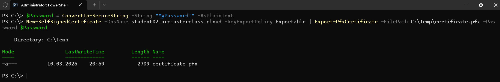

2. **Use the Key Vault Extension**

Follow the steps in the Jumpstart Drop [How to Use the Key Vault Extension to Acquire Certificates on Arc-Enabled Windows Servers](https://jumpstart.azure.com/azure_jumpstart_drops?drop=How%20to%20Use%20the%20Key%20Vault%20Extension%20to%20Acquire%20Certificates%20on%20Arc-Enabled%20Windows%20Servers)

### Module 2: Connect to an Azure Kubernetes Services (AKS) cluster

#### Objective

By the end of this guide, you will be able to connect to an Azure Kubernetes Services (AKS) cluster using `kubectl` from the ArcBox Client VM. You will learn how to view pods and services, use `kubectl` as a proxy to connect to an application for debugging and testing, and inspect the existing GitOps configuration for the `hello-arc` application.

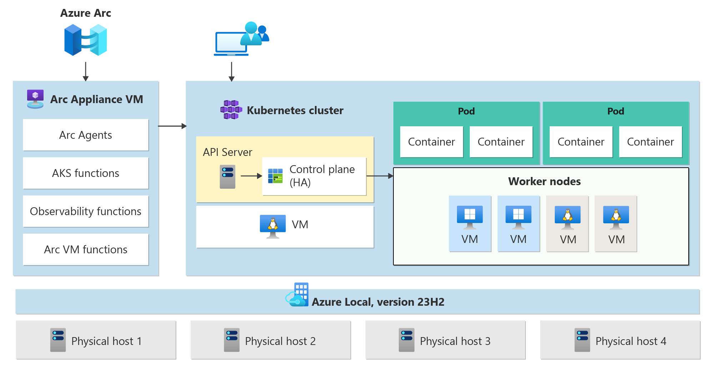

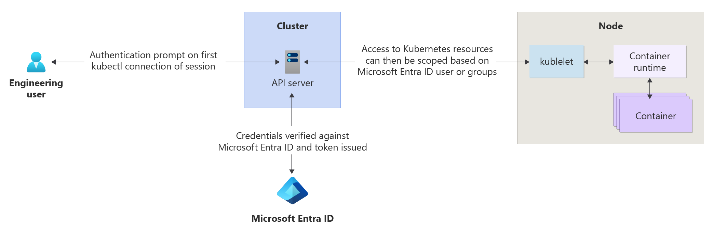

#### Task 1 - Azure authentication

1. **Azure CLI**

    First, log on to the ArcBox Client VM and open Windows Terminal (right-click the Start button and select Terminal).

    Then, run the following commands to re-authenticate to Azure CLI using your student account.

    ```powershell
    az logout
    az login
    ```

*The reason for having to re-authenticate is the CLI is being authenticated using a Managed Identity, which is not supported when interacting with the Arc-enabled Kubernetes proxy command used in this module.*

#### Task 2 - connect to an Azure Kubernetes Services (AKS) cluster

1. **Install `kubectl` on ArcBox Client VM**

    First, log on to the ArcBox Client VM and open Windows Terminal (right-click the Start button and select Terminal). Then, run the following command to install `kubectl` using `winget`:

    ```powershell
    winget install Kubernetes.kubectl -s winget
    ```

2. **Verify the installation**

    After the installation is complete, verify that `kubectl` is installed correctly by running:

    ```powershell
    kubectl version --client
    ```


3. **Connect to the AKS cluster**

    Use the following command to connect to the shared AKS cluster:

    ```powershell
    az connectedk8s proxy -n aks-qa -g Shared
    ```

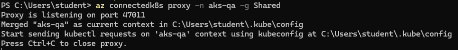

4. **View pods and services**

    List all pods and services in the hello-arc namespace:

    ```powershell
    kubectl get pods -n hello-arc
    kubectl get services n hello-arc
    ```

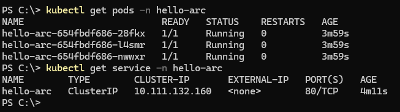

5. **Connect to the demo application**

    Setup and test port-forwarding to your local machine for the `hello-arc` demo application:

    ```powershell
    kubectl port-forward svc/hello-arc -n hello-arc 8080:80
    ```


Open **Microsoft Edge** and access `http://localhost:8080`:

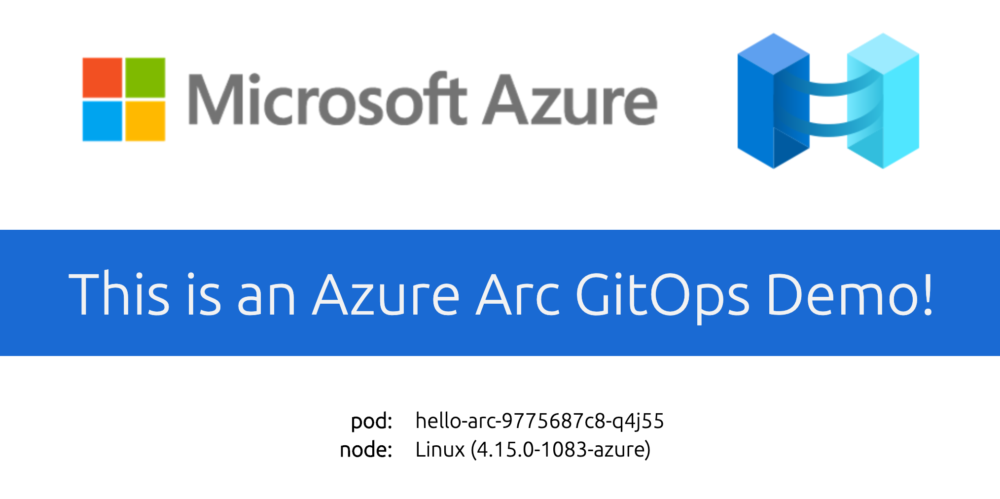

This concludes this module.

For reference, the following screenshots shows how the GitOps configuration was pre-created in the shared environment for this workshop:

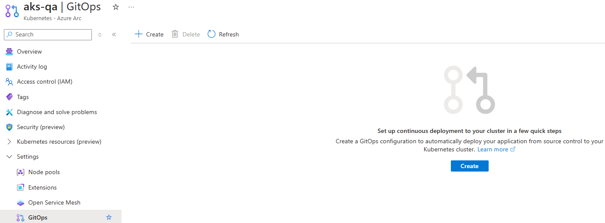

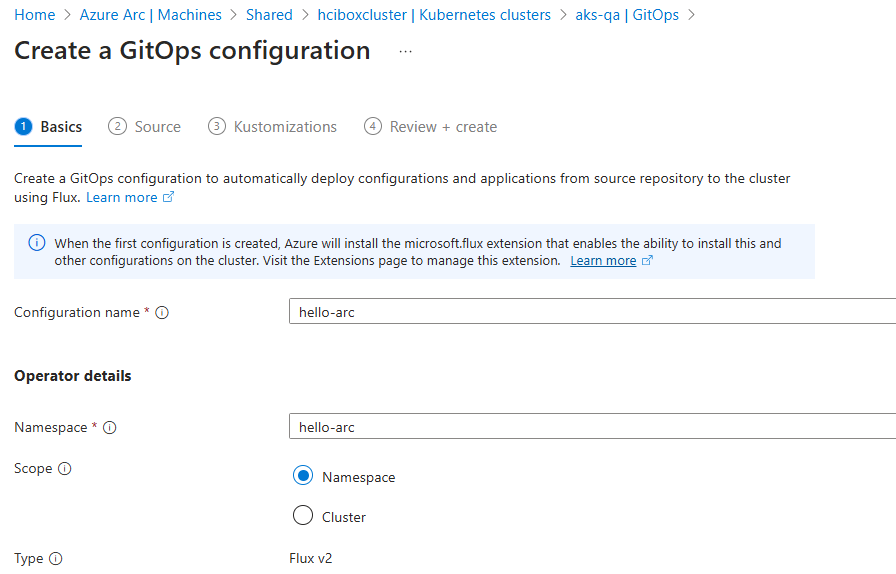

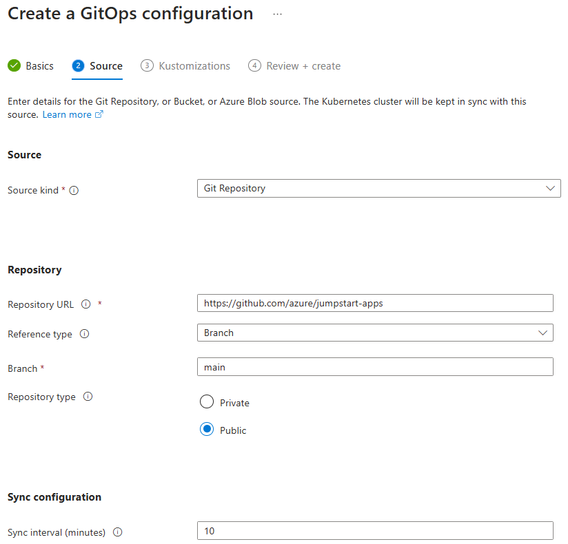

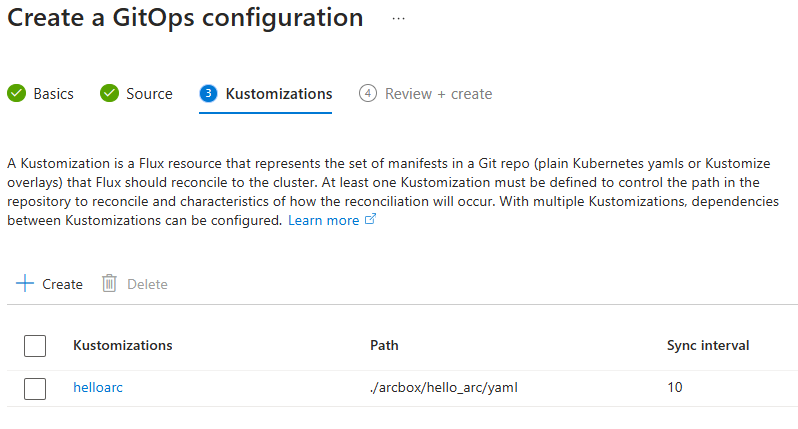

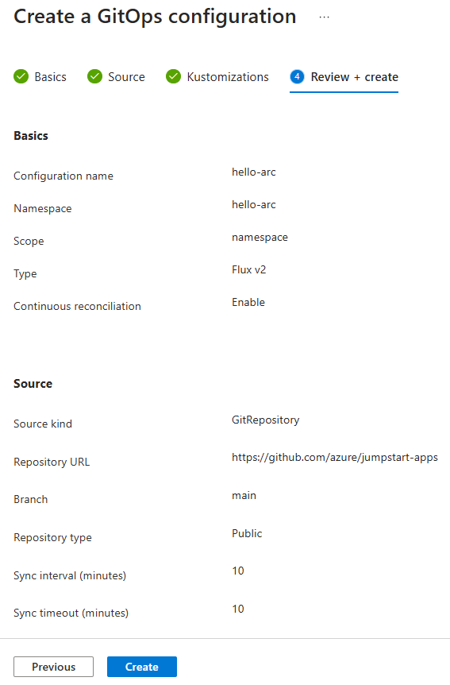

Also for reference, the following screenshots shows how the same configuration steps could be accomplished using Azure CLI:

```powershell
az k8s-configuration flux create `
     --cluster-name aks-qa `
     --resource-group Shared `
     --name config-helloarc `
     --namespace hello-arc `
     --cluster-type connectedClusters `
     --scope namespace `
     --url "https://github.com/azure/jumpstart-apps" `
     --branch main --sync-interval 3s `
     --kustomization name=helloarc path=./arcbox/hello_arc/yaml
```

The following resources in the documentation contains further information about AKS on Azure Local:

- [AKS on Azure Local](https://learn.microsoft.com/azure/aks/aksarc/cluster-architecture)
- [Deploy applications using GitOps with Flux v2](https://learn.microsoft.com/azure/azure-arc/kubernetes/tutorial-use-gitops-flux2?tabs=azure-cli)
- [Implement CI/CD with GitOps (Flux v2)](https://learn.microsoft.com/azure/azure-arc/kubernetes/tutorial-gitops-flux2-ci-cd)

### Module 3: MicroHack Azure Arc for Servers (homework)

#### Objective

This MicroHack scenario walks through the use of Azure Arc with a focus on the best practices and the design principles and some interesting challenges for real world scenarios. Specifically, this builds up to include working with an existing infrastructure in your datacenter.

After completing this MicroHack you will:

- Know how to use Azure Arc in your environment, on-prem or Multi-cloud
- Understand use cases and possible scenarios in your hybrid world to modernize your infrastructure estate
- Get insights into real world challenges and scenarios

#### Task

Review the content in the [MicroHack Azure Arc for Servers](https://github.com/microsoft/MicroHack/tree/main/03-Azure/01-03-Infrastructure/02_Hybrid_Azure_Arc_Servers) and consider if this is something you could leverage for an internal hackathon at your company (or in your personal lab environment after this workshop).

Some of the challenges overlaps with the content in [Lab track 1 - Arc-enabled Servers](https://github.com/Azure/arc_jumpstart_levelup/blob/arc_master_class/docs/azure_arc_servers_jumpstart/_labs_arc-enabled-servers.md), so you may consider looking into the ones who do not, such as **Challenge 4 - Microsoft Defender for Cloud integration with Azure Arc** and **Challenge 5 - Best Practices assessment for Windows Server**.

### Module 4: Certificate-Based Onboarding for Azure Arc-Enabled Servers (homework)

*Since no Certificate Services is available in the lab environment, this exercise needs to be performed in an environment where this is available.*

*For the workshop, read the guide to get an understanding of what is required to leverage certificate based onboarding and consider diving into this in your own lab environment later.*

#### Objective

Azure Arc version 1.41 introduces certificate-based authentication for connecting and disconnecting servers, replacing the old method of using passwords. This new feature makes managing servers easier and more secure. By the end of this guide, you will be able to use certificates to securely manage and onboard your servers to Azure Arc.

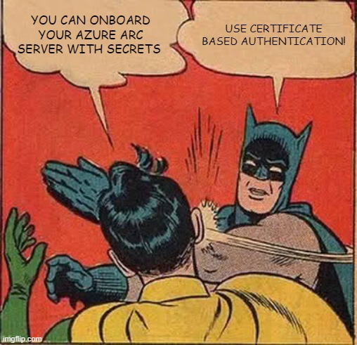

#### Task

Review the steps in the Jumpstart Drop [Certificate-Based Onboarding for Azure Arc-Enabled Servers](https://jumpstart.azure.com/azure_jumpstart_drops?drop=Certificate-Based%20Onboarding%20for%20Azure%20Arc-Enabled%20Servers)
