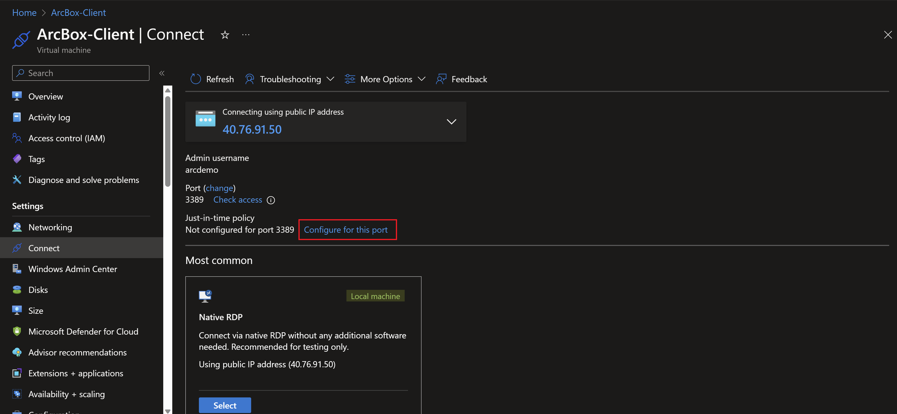
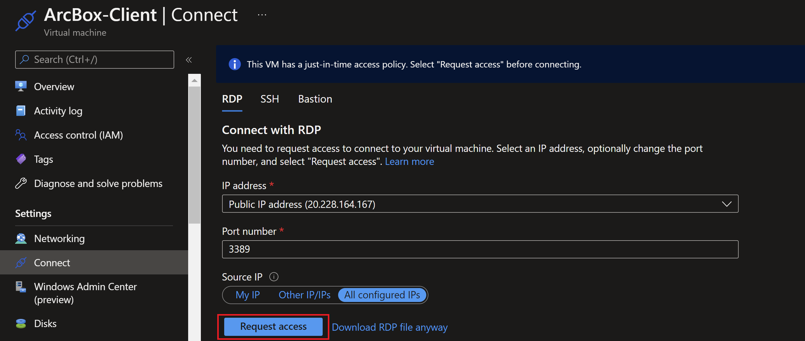

# Azure Arc-enabled Servers - #FollowAlong session at PowerShell Conference Europe 2024

## Goals

In this immersive 90-minute session, participants will embark on a hands-on journey to explore the capabilities of Azure Arc. Utilizing the Azure Arc Jumpstart resources, attendees will gain a deep understanding of how Azure Arc functions and its applications in a real-world scenario. The session is crafted to encourage active participation, enabling attendees to not only listen but also engage directly with the material through hands-on labs.

After completion of this session, you will be able to:

- Understand pre-requisites to onboard Windows and Linux servers to Azure Arc
- Onboard Windows and Linux servers running using different onboarding methods
- Monitor your Azure Arc-enabled servers using Azure Monitor
- Keep your Azure Arc-enabled servers patched using Azure Update Manager
- Monitor changes to your Azure Arc-enabled servers using Change tracking and inventory
- SSH into your Azure Arc-enabled servers using SSH access
- Run scripts in your Arc-enabled Windows server by using Run Commands
- Configure your Azure Arc-enabled servers using Azure Automanage machine configuration
- Manage the Windows operating system of your Arc-enabled servers using Windows Admin Center (Preview)
- Query and inventory your Azure Arc-enabled servers using Azure Resource Graph
- Enforce governance across your Azure Arc-enabled servers using Azure Policy

| Module | Duration | Facilitator |
|---------------|---------------|---------------|
|[**Understand pre-requisites to onboard Windows and Linux servers to Azure Arc**](#levelup-lab-environment) | 5 minutes | Seif Bassem |
|[**1 - Onboard Windows and Linux servers running using different onboarding methods**](#module-1-on-boarding-to-azure-arc-enabled-servers) | 10 minutes | Jan Egil Ring |
|[**2 - Query and inventory your Azure Arc-enabled servers using Azure Resource Graph**](#module-11-query-and-inventory-your-azure-arc-enabled-servers-using-azure-resource-graph) | 5 minutes | Seif Bassem |
|[**3 - Monitor your Azure Arc-enabled servers using Azure Monitor, Change Tracking and Inventoryr**](#module-2-monitor-your-azure-arc-enabled-servers-using-azure-monitor) | 20 minutes | Seif Bassem |
|[**4 - SSH into your Azure Arc-enabled servers using SSH access**](#module-7-ssh-into-your-azure-arc-enabled-servers-using-ssh-access) | 10 minutes | Jan Egil Ring |
|[**5 - Keep your Azure Arc-enabled servers patched using Azure Update Manager**](#module-5-keep-your-azure-arc-enabled-servers-patched-using-azure-manager) | 10 minutes | Seif Bassem |
|**6 Run scripts in your Arc-enabled Windows server by using Run Commands** | 5 minutes | Jan Egil Ring |
|[**7 - Configure your Azure Arc-enabled servers using Azure Automanage machine configuration**](#module-9-configure-your-azure-arc-enabled-servers-using-azure-automanage-machine-configuration) | 15 minutes | Jan Egil Ring |
|[**8 - Manage the Windows operating system of your Arc-enabled Servers using Windows Admin Center (Preview)**](#module-10-manage-your-azure-arc-enabled-servers-using-admin-center-preview) | 5 minutes | Seif Bassem |

## LevelUp lab guidance

There are two ways to get access to the lab modules and guidance.

1. You can use this GitHub repository.
2. You can open the guide using VSCode inside the ArcBox-Client VM to walk you through each module of this levelup.

## Lab Environment

ArcBox PSConfEU edition is a special “flavor” of ArcBox that is intended for users who want to experience Azure Arc-enabled servers' capabilities in a sandbox environment. Screenshot below shows layout of the lab environment.

  

### Prerequisites

- [Install or update Azure CLI to version 2.51.0 and above](https://docs.microsoft.com/cli/azure/install-azure-cli?view=azure-cli-latest). Use the below command to check your current installed version.

  ```shell
  az --version
  ```

    

- Login to AZ CLI using the ```az login``` command.

  ```shell
  az login
  ```

If you have access to multiple tenants, use the `--tenant` switch.

  ```shell
  az login --tenant <tenantId>
  ```

- [Install or update Azure PowerShell](https://learn.microsoft.com/powershell/azure/install-azps-windows). Use the below command to check if its installed.

  ```shell
  Get-Module -Name Az.Accounts -listavailable
  ```

- Login to Azure PowerShell the ```Connect-AzAccount``` command.

  ```shell
  Connect-AzAccount
  ```

- Set the default subscription using Azure CLI.

  ```shell
  $subscriptionId = "<Subscription Id>"
  az account set -s $subscriptionId
  ```

- Set the default subscription using Azure PowerShell.

  ```shell
  $subscriptionId = "<Subscription Id>"
  Set-AzContext -SubscriptionId $subscriptionId
  ```

- Ensure that you have selected the correct subscription you want to deploy ArcBox to by using the ```az account list --query "[?isDefault]"``` command. If you need to adjust the active subscription used by Az CLI, follow [this guidance](https://docs.microsoft.com/cli/azure/manage-azure-subscriptions-azure-cli#change-the-active-subscription).

- ArcBox must be deployed to one of the following regions. **Deploying ArcBox outside of these regions may result in unexpected results or deployment errors.**

  - East US
  - East US 2
  - Central US
  - West US 2
  - North Europe
  - West Europe
  - France Central
  - UK South
  - Australia East
  - Japan East
  - Korea Central
  - Southeast Asia

- **ArcBox requires 16 DSv5-series vCPUs** when deploying with default parameters such as VM series/size. Ensure you have sufficient vCPU quota available in your Azure subscription and the region where you plan to deploy ArcBox. You can use the below Az CLI command to check your vCPU utilization.

  ```shell
  az vm list-usage --location <your location> --output table
  ```

  

- Register necessary Azure resource providers by running the following commands.

  ```shell
  az provider register --namespace Microsoft.HybridCompute --wait
  az provider register --namespace Microsoft.GuestConfiguration --wait
  az provider register --namespace Microsoft.AzureArcData --wait
  az provider register --namespace Microsoft.OperationsManagement --wait
  az provider register --namespace Microsoft.SecurityInsights --wait
  ```

- To deploy ArcBox, an Azure account assigned with the _Owner_ Role-based access control (RBAC) role is required.

    > **NOTE: The Jumpstart scenarios are designed with as much ease of use in-mind and adhering to security-related best practices whenever possible. It is optional but highly recommended to scope the access to a specific [Azure subscription and resource group](https://docs.microsoft.com/cli/azure/ad/sp?view=azure-cli-latest) as well considering using a [less privileged service principal account](https://docs.microsoft.com/azure/role-based-access-control/best-practices)**

### Deployment

#### Deployment Option 1: Azure portal

- Click the <a href="https://portal.azure.com/#create/Microsoft.Template/uri/https%3A%2F%2Fraw.githubusercontent.com%2FAzure%2Farc_jumpstart_levelup%2Fpsconfeu%2Fazure_arc_servers_jumpstart%2FARM%2Fazuredeploy.json" target="_blank"></a> button and enter values for the the ARM template parameters.

  

  

  

    > **NOTE: The deployment takes around 10 minutes to complete.**

    > **NOTE: If you see any failure in the deployment, please check the [troubleshooting guide](https://azurearcjumpstart.io/azure_jumpstart_arcbox/itpro/#basic-troubleshooting).**

### Deployment Option 2: Bicep deployment via Azure CLI

- Clone the Azure Arc Jumpstart repository

  ```shell
  $folderPath = <Specify a folder path to clone the repo>

  Set-Location -Path $folderPath
  git clone https://github.com/azure/arc_jumpstart_levelup.git
  git checkout psconfeu
  Set-Location -Path "azure_arc\azure_jumpstart_arcbox_servers_levelup\bicep"
  ```

- Upgrade to latest Bicep version

  ```shell
  az bicep upgrade
  ```

- Edit the [main.parameters.json](https://github.com/Azure/arc_jumpstart_levelup/blob/main/azure_arc_servers_jumpstart/bicep/main.parameters.json) template parameters file and supply some values for your environment.
  - _`spnTenantId`_ - Your Azure tenant id
  - _`windowsAdminUsername`_ - Client Windows VM Administrator name
  - _`windowsAdminPassword`_ - Client Windows VM Password. Password must have 3 of the following: 1 lower case character, 1 upper case character, 1 number, and 1 special character. The value must be between 12 and 123 characters long.
  - _`logAnalyticsWorkspaceName`_ - Unique name for the ArcBox Log Analytics workspace
  - _`emailAddress`_ - Your email address, to configure alerts for the monitoring action group

  

- Now you will deploy the Bicep file. Navigate to the local cloned [deployment folder](https://github.com/Azure/arc_jumpstart_levelup/blob/main/azure_arc_servers_jumpstart/bicep) and run the below command:

  ```shell
  az group create --name "<resource-group-name>" --location "<preferred-location>"
  az deployment group create -g "<resource-group-name>" -f "main.bicep" -p "main.parameters.json"
  ```

    > **NOTE: If you see any failure in the deployment, please check the [troubleshooting guide](https://azurearcjumpstart.io/azure_jumpstart_arcbox/itpro/#basic-troubleshooting).**

    > **NOTE: The deployment takes around 20 minutes to complete.**

### Connecting to the ArcBox Client virtual machine

Various options are available to connect to _ArcBox-Client_ VM, depending on the parameters you supplied during deployment.

- [RDP](https://azurearcjumpstart.io/azure_jumpstart_arcbox/ITPro/#connecting-directly-with-rdp) - available after configuring access to port 3389 on the _ArcBox-NSG_, or by enabling [Just-in-Time access (JIT)](https://azurearcjumpstart.io/azure_jumpstart_arcbox/ITPro/#connect-using-just-in-time-accessjit).
- [Azure Bastion](https://azurearcjumpstart.io/azure_jumpstart_arcbox/ITPro/#connect-using-azure-bastion) - available if ```true``` was the value of your _`deployBastion`_ parameter during deployment.

#### Connecting directly with RDP

By design, ArcBox does not open port 3389 on the network security group. Therefore, you must create an NSG rule to allow inbound 3389.

- Open the _ArcBox-NSG_ resource in Azure portal and click "Add" to add a new rule.

  

  

- Specify the IP address that you will be connecting from and select RDP as the service with "Allow" set as the action. You can retrieve your public IP address by accessing [https://icanhazip.com](https://icanhazip.com) or [https://whatismyip.com](https://whatismyip.com).

  

  

  

#### Connect using Azure Bastion

- If you have chosen to deploy Azure Bastion in your deployment, use it to connect to the VM.

  

  > **NOTE: When using Azure Bastion, the desktop background image is not visible. Therefore some screenshots in this guide may not exactly match your experience if you are connecting to _ArcBox-Client_ with Azure Bastion.**

#### Connect using just-in-time access (JIT)

If you already have [Microsoft Defender for Cloud](https://docs.microsoft.com/azure/defender-for-cloud/just-in-time-access-usage?tabs=jit-config-asc%2Cjit-request-asc) enabled on your subscription and would like to use JIT to access the Client VM, use the following steps:

- In the Client VM configuration pane, enable just-in-time. This will enable the default settings.

  

  

  

#### The Logon scripts

- Once you log into the _ArcBox-Client_ VM, multiple automated scripts will open and start running. These scripts usually take 10-20 minutes to finish, and once completed, the script windows will close automatically. At this point, the deployment is complete.

  

- Deployment is complete! Let's begin exploring the features of Azure Arc-enabled servers with the lab modules.

  

  

## Modules

### Module 1: On-boarding to Azure Arc-enabled servers

