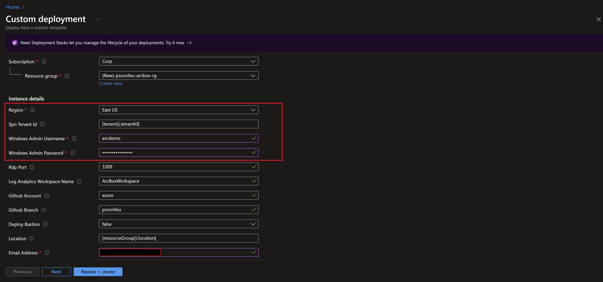
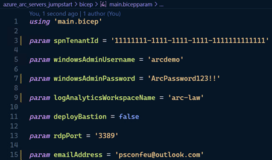
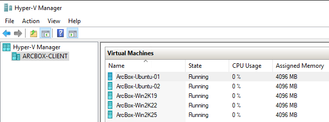
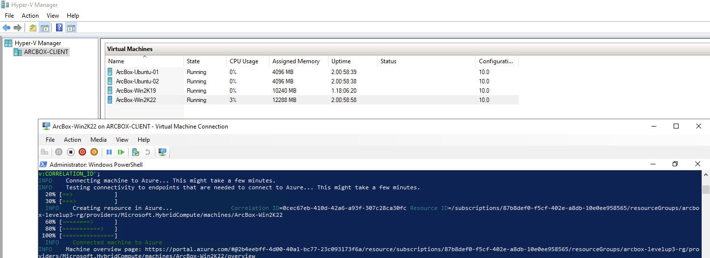
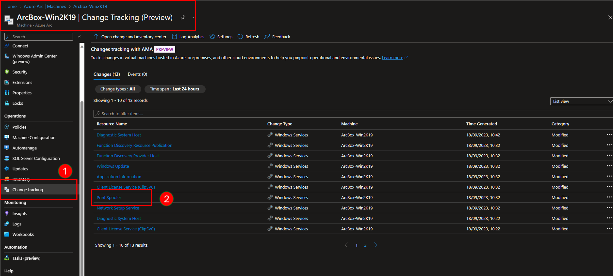
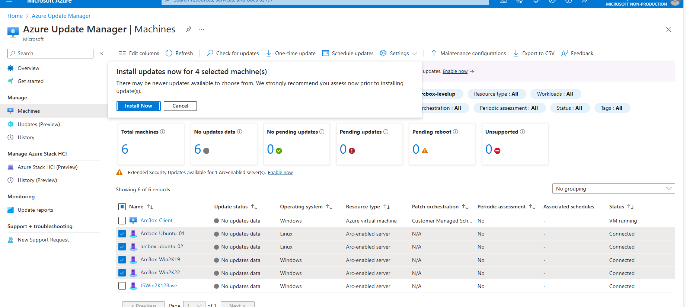

# Azure Arc-enabled Servers - #FollowAlong session at PowerShell Conference Europe 2024

## Goals

In this immersive 90-minute session, participants will embark on a hands-on journey to explore the capabilities of Azure Arc. Utilizing the Azure Arc Jumpstart resources, attendees will gain a deep understanding of how Azure Arc functions and its applications in a real-world scenario. The session is crafted to encourage active participation, enabling attendees to not only listen but also engage directly with the material through hands-on labs.

After completion of this session, you will be able to:

- Understand pre-requisites to onboard Windows and Linux servers to Azure Arc
- Onboard Windows and Linux servers running using different onboarding methods
- Monitor your Azure Arc-enabled servers using Azure Monitor
- Keep your Azure Arc-enabled servers patched using Azure Update Manager
- Monitor changes to your Azure Arc-enabled servers using Change tracking and inventory
- SSH into your Azure Arc-enabled servers using SSH access
- Run scripts in your Arc-enabled Windows server by using Run Commands
- Configure your Azure Arc-enabled servers using Azure Automanage machine configuration
- Manage the Windows operating system of your Arc-enabled servers using Windows Admin Center (Preview)
- Query and inventory your Azure Arc-enabled servers using Azure Resource Graph
- Enforce governance across your Azure Arc-enabled servers using Azure Policy

| Module | Duration | Facilitator |
|---------------|---------------|---------------|
|[**Understand pre-requisites to onboard Windows and Linux servers to Azure Arc**](#levelup-lab-environment) | 5 minutes | Seif Bassem |
|[**1 - Onboard Windows and Linux servers running using different onboarding methods**](#module-1-on-boarding-to-azure-arc-enabled-servers) | 10 minutes | Jan Egil Ring |
|[**2 - Query and inventory your Azure Arc-enabled servers using Azure Resource Graph**](#module-2-query-and-inventory-your-azure-arc-enabled-servers-using-azure-resource-graph) | 5 minutes | Seif Bassem |
|[**3 - Monitor your Azure Arc-enabled servers using Azure Monitor, Change Tracking and Inventory**](#module-3-monitor-your-azure-arc-enabled-servers-using-azure-monitor-change-tracking-and-inventory) | 20 minutes | Seif Bassem |
|[**4 - SSH into your Azure Arc-enabled servers using SSH access**](#module-4-ssh-into-your-azure-arc-enabled-servers-using-ssh-access) | 10 minutes | Jan Egil Ring |
|[**5 - Keep your Azure Arc-enabled servers patched using Azure Update Manager**](#module-5-keep-your-azure-arc-enabled-servers-patched-using-azure-update-manager) | 10 minutes | Seif Bassem |
|[**6 - Configure your Azure Arc-enabled servers using Azure Automanage machine configuration**](#module-7-configure-your-azure-arc-enabled-servers-using-azure-automanage-machine-configuration) | 15 minutes | Jan Egil Ring |
|[**7 - Manage your Arc-enabled Windows machines using the Windows Admin Center**](#module-8-manage-your-arc-enabled-windows-machines-using-the-windows-admin-center) | 5 minutes | Seif Bassem |

## LevelUp lab guidance

There are two ways to get access to the lab modules and guidance.

1. You can use this GitHub repository.
2. You can open the guide using VSCode inside the ArcBox-Client VM to walk you through each module of this levelup.

## Lab Environment

ArcBox PSConfEU edition is a special “flavor” of ArcBox that is intended for users who want to experience Azure Arc-enabled servers' capabilities in a sandbox environment. Screenshot below shows layout of the lab environment.

  

### Prerequisites

- [Install or update Azure CLI to version 2.51.0 and above](https://docs.microsoft.com/cli/azure/install-azure-cli?view=azure-cli-latest). Use the below command to check your current installed version.

  ```shell
  az --version
  ```

    

- Login to AZ CLI using the ```az login``` command.

  ```shell
  az login
  ```

If you have access to multiple tenants, use the `--tenant` switch.

  ```shell
  az login --tenant <tenantId>
  ```

- [Install or update Azure PowerShell](https://learn.microsoft.com/powershell/azure/install-azps-windows). Use the below command to check if its installed.

  ```shell
  Get-Module -Name Az.Accounts -listavailable
  ```

- Login to Azure PowerShell the ```Connect-AzAccount``` command.

  ```shell
  Connect-AzAccount
  ```

- Set the default subscription using Azure CLI.

  ```shell
  $subscriptionId = "<Subscription Id>"
  az account set -s $subscriptionId
  ```

- Set the default subscription using Azure PowerShell.

  ```shell
  $subscriptionId = "<Subscription Id>"
  Set-AzContext -SubscriptionId $subscriptionId
  ```

- Ensure that you have selected the correct subscription you want to deploy ArcBox to by using the ```az account list --query "[?isDefault]"``` command. If you need to adjust the active subscription used by Az CLI, follow [this guidance](https://docs.microsoft.com/cli/azure/manage-azure-subscriptions-azure-cli#change-the-active-subscription).

- ArcBox must be deployed to one of the following regions. **Deploying ArcBox outside of these regions may result in unexpected results or deployment errors.**

  - East US
  - East US 2
  - Central US
  - West US 2
  - North Europe
  - West Europe
  - France Central
  - UK South
  - Australia East
  - Japan East
  - Korea Central
  - Southeast Asia

- **ArcBox requires 16 DSv5-series vCPUs** when deploying with default parameters such as VM series/size. Ensure you have sufficient vCPU quota available in your Azure subscription and the region where you plan to deploy ArcBox. You can use the below Az CLI command to check your vCPU utilization.

  ```shell
  az vm list-usage --location <your location> --output table
  ```

  

- Register necessary Azure resource providers by running the following commands.

  ```shell
  az provider register --namespace Microsoft.HybridCompute --wait
  az provider register --namespace Microsoft.GuestConfiguration --wait
  az provider register --namespace Microsoft.AzureArcData --wait
  az provider register --namespace Microsoft.OperationsManagement --wait
  az provider register --namespace Microsoft.SecurityInsights --wait
  ```

- To deploy ArcBox, an Azure account assigned with the _Owner_ Role-based access control (RBAC) role is required.

    > **NOTE: The Jumpstart scenarios are designed with as much ease of use in-mind and adhering to security-related best practices whenever possible. It is optional but highly recommended to scope the access to a specific [Azure subscription and resource group](https://docs.microsoft.com/cli/azure/ad/sp?view=azure-cli-latest) as well considering using a [less privileged service principal account](https://docs.microsoft.com/azure/role-based-access-control/best-practices)**

### Deployment

#### Deployment Option 1: Azure portal

- Click the <a href="https://portal.azure.com/#create/Microsoft.Template/uri/https%3A%2F%2Fraw.githubusercontent.com%2FAzure%2Farc_jumpstart_levelup%2Fpsconfeu%2Fazure_arc_servers_jumpstart%2FARM%2Fazuredeploy.json" target="_blank"></a> button and enter values for the the ARM template parameters.

  

  

  

    > **NOTE: The deployment takes around 10 minutes to complete.**

    > **NOTE: If you see any failure in the deployment, please check the [troubleshooting guide](https://azurearcjumpstart.io/azure_jumpstart_arcbox/itpro/#basic-troubleshooting).**

### Deployment Option 2: Bicep deployment via Azure CLI

- Clone the Azure Arc Jumpstart repository

  ```shell
  $folderPath = <Specify a folder path to clone the repo>

  Set-Location -Path $folderPath
  git clone https://github.com/azure/arc_jumpstart_levelup.git
  git checkout psconfeu
  Set-Location -Path "azure_arc\azure_jumpstart_arcbox_servers_levelup\bicep"
  ```

- Upgrade to latest Bicep version

  ```shell
  az bicep upgrade
  ```

- Edit the [main.parameters.json](https://github.com/Azure/arc_jumpstart_levelup/blob/main/azure_arc_servers_jumpstart/bicep/main.parameters.json) template parameters file and supply some values for your environment.
  - _`spnTenantId`_ - Your Azure tenant id
  - _`windowsAdminUsername`_ - Client Windows VM Administrator name
  - _`windowsAdminPassword`_ - Client Windows VM Password. Password must have 3 of the following: 1 lower case character, 1 upper case character, 1 number, and 1 special character. The value must be between 12 and 123 characters long.
  - _`logAnalyticsWorkspaceName`_ - Unique name for the ArcBox Log Analytics workspace
  - _`emailAddress`_ - Your email address, to configure alerts for the monitoring action group

  

- Now you will deploy the Bicep file. Navigate to the local cloned [deployment folder](https://github.com/Azure/arc_jumpstart_levelup/blob/main/azure_arc_servers_jumpstart/bicep) and run the below command:

  ```shell
  az group create --name "<resource-group-name>" --location "<preferred-location>"
  az deployment group create -g "<resource-group-name>" -f "main.bicep" -p "main.parameters.json"
  ```

    > **NOTE: If you see any failure in the deployment, please check the [troubleshooting guide](https://azurearcjumpstart.io/azure_jumpstart_arcbox/itpro/#basic-troubleshooting).**

    > **NOTE: The deployment takes around 20 minutes to complete.**

### Connecting to the ArcBox Client virtual machine

Various options are available to connect to _ArcBox-Client_ VM, depending on the parameters you supplied during deployment.

- [RDP](https://azurearcjumpstart.io/azure_jumpstart_arcbox/ITPro/#connecting-directly-with-rdp) - available after configuring access to port 3389 on the _ArcBox-NSG_, or by enabling [Just-in-Time access (JIT)](https://azurearcjumpstart.io/azure_jumpstart_arcbox/ITPro/#connect-using-just-in-time-accessjit).
- [Azure Bastion](https://azurearcjumpstart.io/azure_jumpstart_arcbox/ITPro/#connect-using-azure-bastion) - available if ```true``` was the value of your _`deployBastion`_ parameter during deployment.

#### Connecting directly with RDP

By design, ArcBox does not open port 3389 on the network security group. Therefore, you must create an NSG rule to allow inbound 3389.

- Open the _ArcBox-NSG_ resource in Azure portal and click "Add" to add a new rule.

  

  

- Specify the IP address that you will be connecting from and select RDP as the service with "Allow" set as the action. You can retrieve your public IP address by accessing [https://icanhazip.com](https://icanhazip.com) or [https://whatismyip.com](https://whatismyip.com).

  

  

  

#### Connect using Azure Bastion

- If you have chosen to deploy Azure Bastion in your deployment, use it to connect to the VM.

  

  > **NOTE: When using Azure Bastion, the desktop background image is not visible. Therefore some screenshots in this guide may not exactly match your experience if you are connecting to _ArcBox-Client_ with Azure Bastion.**

#### The Logon scripts

- Once you log into the _ArcBox-Client_ VM, multiple automated scripts will open and start running. These scripts usually take 10-20 minutes to finish, and once completed, the script windows will close automatically. At this point, the deployment is complete.

  

- Deployment is complete! Let's begin exploring the features of Azure Arc-enabled servers with the lab modules.

  

  

## Modules

### Module 1: On-boarding to Azure Arc-enabled servers

#### Objective

The deployment process that you have walked through in Lab01 should have set up four VMs running on Hyper-V in the ArcBox-Client machine. Two of these machines have been connected to Azure Arc for you by the set script. In this exercise you will verify that these two machines are indeed Arc-enabled and you will identify the other two machines that you will Arc-enable.

##### Task 1: Use the Azure portal to examine you Arc-enabled machines inventory

1. Enter "Machines - Azure Arc" in the top search bar in the Azure portal and select it from the displayed services.


2. You should see the machines that are connected to Arc already: Arcbox-Ubuntu-01, ArcBox-Win2k12 and ArcBox-Win2K19.


##### Task 2:  Examine the virtual machines that you will Arc-enable

1. For the follow-along session you want to connect one of the other available machines running as VMs in the ArcBox-Client. You can see these (ArcBox-Win2K22 and ArcBox-Ubuntu-02) by running the Hyper-V Manager in the ArcBox-Client (after you have connected to it with RDP as explained earlier in Lab01).



##### Task 3: Installation and registration of the Azure Arc connected machine agent for a Windows machine

1. From the Azure portal go to the "Machines - Azure Arc" page and select "Add/Create" at the upper left, then select "Add a machine".


2. In the next screen, go to "Add a single sever" and click on "Generate script".

3. Fill in the Resource Group, Region, Operating System (Windows), keep Connectivity as "Public endpoint". Then download the script to your local machine (or you can copy the content into the clipboard).

4. Go to the ArcBox-Client machine via RDP and from Hyper-V manager right-click on the ArcBox-Win2K22 VM and click "Connect" (Administrator default password is ArcDemo123!!). Then start PowerShell in the ArcBox-Win2K22 VM and copy the content of the onboarding script into the terminal.



6. On successful completion a message is displayed to confirm the machine is connected to Azure Arc. We can also verify that our Windows machine is connected in the Azure portal (Machines - Azure Arc).


For more information about deployment options, see the following two articles:
- [Azure Connected Machine agent deployment options](https://learn.microsoft.com/azure/azure-arc/servers/deployment-options)
- [Connect hybrid machines to Azure at scale](https://learn.microsoft.com/azure/azure-arc/servers/onboard-service-principal).

### Module 2: Query and inventory your Azure Arc-enabled servers using Azure Resource Graph

#### Objective

In this module, you will learn how to use the Azure Resource queries both in the Azure Graph Explorer and Powershell to demonstrate inventory management of your Azure Arc connected servers. Note that the results you get by running the graph queries in this module might be different from the sample screenshots as your environment might be different.

#### Task 1: Apply resource tags to Azure Arc-enabled servers

In this first step, you will assign Azure resource tags to some of your Azure Arc-enabled servers. This gives you the ability to easily organize and manage server inventory.

- Enter "Machines - Azure Arc" in the top search bar in the Azure portal and select it from the displayed services.

    

- Click on the Windows 2019 Azure Arc-enabled server.

    

- Click on "Tags". Add a new tag with Name="Scenario” and Value="azure_arc_servers_inventory”. Click Apply when ready.

    

- Repeat the same process in other Azure Arc-enabled servers if you wish. This new tag will be used later when working with Resource Graph Explorer queries.

#### Task 2: The Azure Resource Graph Explorer

- Now, we will explore our hybrid server inventory using a number of Azure Graph Queries. Enter "Resource Graph Explorer" in the top search bar in the Azure portal and select it.

    

- The scope of the Resource Graph Explorer can be set as seen below

    

#### Task 3: Run a query to show all Azure Arc-enabled servers in your subscription

- In the query window, enter and run the following query and examine the results which should show your Arc-enabled servers. Note the use of the KQL equals operator (=~) which is case insensitive [KQL =~ (equals) operator](https://learn.microsoft.com/azure/data-explorer/kusto/query/equals-operator).

    ```shell
    Resources
    | where type =~ 'Microsoft.HybridCompute/machines'
    ```

    

- Scroll to the right on the results pane and click "See Details" to see all the Azure Arc-enabled server metadata. Note for example the list of detected properties, we will be using these in the next task.

- You can also run the same query using PowerShell (e.g. using Azure Cloud Shell) providing that you have added the required module "Az.ResourceGraph" as explained in [Run your first Resource Graph query using Azure PowerShell](https://learn.microsoft.com/azure/governance/resource-graph/first-query-powershell#add-the-resource-graph-module).

To install the PowerShell module, run the following command

  ```powershell
  Install-Module -Name Az.ResourceGraph
  ```

Then run the query in PowerShell

  ```powershell
  Search-AzGraph -Query "Resources | where type =~ 'Microsoft.HybridCompute/machines'"
  ```

#### Task 4: Query your server inventory using the available metadata

- Use PowerShell and the Resource Graph Explorer to summarize the server count by "logical cores" which is one of the detected properties referred to in the previous task. Remember to only use the query string, which is enclosed in double quotes, if you want to run the query in the portal.

    ```powershell
    Search-AzGraph -Query  "Resources
    | where type =~ 'Microsoft.HybridCompute/machines'
    | extend logicalCores = tostring(properties.detectedProperties.logicalCoreCount)
    | summarize serversCount = count() by logicalCores"
    ```

- The Graph Explorer allows you to get a graphical view of your results by selecting the "charts" option.

    

#### Task 5: Use the resource tags in your Graph Query

- Let’s now build a query that uses the tag we assigned earlier to some of our Azure Arc-enabled servers. Use the following query that includes a check for resources that have a value for the "Scenario" tag. Feel free to use the portal or PowerShell. Check that the results match the servers that you set tags for earlier.

    ```powershell
    Search-AzGraph -Query  "Resources
    | where type =~ 'Microsoft.HybridCompute/machines' and isnotempty(tags['Scenario'])
    | extend Scenario = tags['Scenario']
    | project name, tags"
    ```

#### Task 6: List the extensions installed on the Azure Arc-enabled servers

- Run the following advanced query which allows you to see what extensions are installed on the Arc-enabled servers. Notice that running the query in PowerShell requires us to escape the $ character as explained in [Escape Characters](https://learn.microsoft.com/azure/governance/resource-graph/concepts/query-language#escape-characters).

    ```powershell
    Search-AzGraph -Query "Resources
    | where type == 'microsoft.hybridcompute/machines'
    | project id, JoinID = toupper(id), ComputerName = tostring(properties.osProfile.computerName), OSName = tostring(properties.osName)
    | join kind=leftouter(
        Resources
        | where type == 'microsoft.hybridcompute/machines/extensions'
        | project MachineId = toupper(substring(id, 0, indexof(id, '/extensions'))), ExtensionName = name
    ) on `$left.JoinID == `$right.MachineId
    | summarize Extensions = make_list(ExtensionName) by id, ComputerName, OSName
    | order by tolower(OSName) desc"
    ```

- If you have used the portal to run the query then you should remove the escape from the $ character ($left.JohnID and $right.MachinID) before running the query as shown in the screenshot below.

    

#### Task 7: Query other properties

- Azure Arc provides additional properties on the Azure Arc-enabled server resource that we can query with Resource Graph Explorer. In the following example, we list some of these key properties, like the Azure Arc Agent version installed on your Azure Arc-enabled servers

    ```powershell
    Search-AzGraph -Query  "Resources
    | where type =~ 'Microsoft.HybridCompute/machines'
    | extend arcAgentVersion = tostring(properties.['agentVersion']), osName = tostring(properties.['osName']), osVersion = tostring(properties.['osVersion']), osSku = tostring(properties.['osSku']),
    lastStatusChange = tostring(properties.['lastStatusChange'])
    | project name, arcAgentVersion, osName, osVersion, osSku, lastStatusChange"
    ```

- Running the same query in the portal should result in something like the following

    

### Module 3: Monitor your Azure Arc-enabled servers using Azure Monitor, Change Tracking and Inventory

#### Objective

In this module, you will learn how to deploy the Azure Monitor agent to your Arc-enabled Windows and Linux machines, how to deploy the dependency agent to your Arc-enabled Windows machines, how to enable the _VM Insights_ solution to start monitoring your machines using Azure Monitor, how to run queries on the Log analytics workspace and how to configure alerts. In addition, you will learn how to use the Change Tracking and Inventory features to track changes in your machine. Change Tracking and Inventory is an built-in Azure service, provided by Azure Automation. The new version uses the Azure Monitor Agent AMA as opposed to the Log Analytics Agent. You will be using the new version in this exercise.

#### Task 1: Monitor your Arc-enabled servers' performance using VMInsights

As part of the automation, we deploy the Azure Monitor Agents to the Windows and Linux machines, data collection rule for VMInsights and configure the VMInsight solution for you.

- Enter "Machines - Azure Arc" in the top search bar in the Azure portal and select it from the displayed services.

    

- Click on the Windows 2019 Azure Arc-enabled **Windows** servers.

    

- Click on the **Extensions** tab to validate the installation of the Azure Monitor Agent extension successful deployment.

    

- Click on the **Insights** tab to view the different metrics of your servers.

    

- Explore also the **Dependency map solution** to view the different connections the Arc-enabled server is making.

    

#### Task 2: Configure data collection for logs and metrics

As part of the ArcBox automation, some alerts and workbooks have been created to demonstrate the different monitoring operations you can perform after onboarding the Arc-enabled machines. You will now configure some data collection rules to start sending the needed metrics and logs to the Log Analytics workspace.

- In the Azure portal, search for _Data Collection rules_.

    

- Create a new data collection rule.

    

- Provide a name and select the same resource group where ArcBox is deployed. Make sure to select Windows as the operating system.

    

- In the "Resources" tab, select the right resource group and the Arc-enabled servers onboarded.

    

- Add a new "Performance Counters" data source, and make sure to select all the custom counters.

    

- Add a new "Azure Monitor Logs" destination and select the log analytics workspace deployed in the ArcBox resource group and save.

    

- Add a new "Windows Event logs" data source.

    

- Select _Critial_, _Error_ and _Warning_ events in the Application and System logs and add the data source.

    

- Save and create the data collection rule.

- Repeat the previous steps to create another Linux data collection rule.

    

    

    

- After waiting for 5-10 minutes for the data collection rule to start collecting data, restart the servers in the Hyper-V manager on the _ArcBox-Client_ VM to trigger some new events.

    

#### Task 3: View alerts and visualizations

**NOTE: It might take some time for all visualizations to load properly**

- In Azure Monitor, click on _Alerts_. and select _Alert rules_

    

- Explore the alert rules crated for you.

    

- Go back to Azure Monitor and click on _Workbooks_. There are three workbooks deployed for you.

    

    

    

    

#### Task 4: Enable Change Tracking and Inventory

- To enable these features you would need to set up a Data Collection Rule that would collect the right events and data for Change Tracking and Inventory and create an Azure policy to onboard your Arc-enabled machines to Change Tracking. **For the purposes of this workshop** - these tasks have all been done for you, so you do not need to do them manually. Follow the link [here](https://learn.microsoft.com/azure/automation/change-tracking/enable-vms-monitoring-agent?tabs=singlevm%2Carcvm#enable-change-tracking-at-scale-using-azure-monitoring-agent) to learn how to do these yourself in future.

- Verify that Change Tracking and Inventory is now enabled and the Arc VMs are reporting status.

    

#### Task 5: Track changes in Windows services

- From the "Change tracking" settings select "Windows Services" and change the "Collection Frequency" to 20 minutes.

    

-  Go to the ArcBox-Client machine via RDP and from Hyper-V manager right-click on one of the Arc-enabled VMs then click "Connect" (Administrator default password is ArcDemo123!!). Try stopping the "Print Spooler" service on the **Arc-enabled machine** using an administrative powershell session (or from the Services desktop application).

      ```PowerShell
      Stop-Service spooler
      ```

- The service changes will eventually show up in the "Change tracking" page for the Arc-enabled machine.
(By default Windows services status are updated every 30 minutes but you changed that to 20 minutes earlier to speed up the result for this task).

    

- You can restart the spooler service on the server if you wish and change tracking will show the outcome in the portal after few minutes.

  ```PowerShell
  Start-Service spooler
  ```

#### Task 6: Track file changes

- Navigate to one of the Arc-enabled Windows machines and select "Change tracking" then select "Settings" then select "Windows Files". You should see the "Add windows file setting" screen on the right hand side. Configure these settings to track the changes to the file "c:\windows\system32\drivers\etc\hosts" and to upload the file content.

    

- Set the file location where changed files will be uploaded. You should have a storage account deployed in the resource group of this lab.

    

- Navigate to the storage account. Click on "Containers" and you should see a container created automatically for you by Azure Change Tracking.

    

- Click on the "changetrackingblob" container, and in the next page select "Access Control (IAM)", then on "Add role assignment".

    

- Select the Storage Blob Data Contributor role then assign the role to the Windows Arc enabled machines managed identity.

    

    

- Modify the _hosts_ file on the Arc-enabled machine (c:\Windows\System32\Drivers\etc\hosts).

**NOTE: To modify the hosts file, open _Notepad_ as administrator, select File>Open, and then browse to c:\Windows\System32\Drivers\etc\hosts file**

- Add a line like this from an administrative notepad and save the file.

  ```shell
  1.1.1.1      www.fakehost.com
  ```

- Eventually, the file changes will show up in the change tracking page of the machine (it might take some time to show so move on to other tasks and come back to check later). The file changed content will also be uploaded to the "changetrackingblob" storage container.

    

#### Task 7: Query in Log Analytics

- On the Change tracking page from your Arc-enabled machine, select _Log Analytics_.

- In the Logs search, look for content changes to the _hosts_ file by entering and running the following query. The result should show information about the changes.

```shell
ConfigurationChange | where FieldsChanged contains "FileContentChecksum" and FileSystemPath == "c:\\windows\\system32\\drivers\\etc\\hosts"
```

  

  >**NOTE (Optional) In Log Analytics, alerts are always created based on log analytics query result. If you want to be alerted when someone changes the _hosts_ file on any one of your server, then you can configure an alert by referring to this [tutorial](https://learn.microsoft.com/azure/azure-monitor/alerts/tutorial-log-alert).**

### Module 5: Enable Azure update manager for the Arc-enabled servers

#### Objective

Azure Update Manager is the new service that unifies all VMs running in Azure together with Azure Arc, putting all update tasks in 1 common area for all supported Linux and Windows versions.
This service is NOT dependent on Log analytics agent. (The older Azure Automation Update service relies on Log Analytics agent)

In this module, you will setup Azure update manager and learn how to enable it to efficiently manage all updates for your machines, regardless of where they are. You will also see some of the default reports using workbooks to monitor your Azure update manager environment.

#### Task 1: Use the Azure portal and search for Azure Update manager

- Click on "Machines" in the left blade to view all your Azure machines.

Note that all the Azure VMs and Arc-enabled server that are already visible in this Azure Update Manager service.

   

- Select the Arc-enabled machines and click on the refresh button to refresh the current status of selected VMs.

   

- **Optional** - you can enable automatic recurring task for at scale refresh once every 24 hours.

   Select the Arc-enabled servers, click on settings then choose update settings, and set the periodic assessement drop down to enable.

  Note that the rest of the VMs will automatically be enabled.

   

#### Task 2: Create a maintenance configuration from Azure update manager.

- Click on Maintenance configuration in the top of the screen as shown below

   

- Fill out the basics tab as shown below, make sure you choose a region based on your location. Leave the rest as default.

   

- **Optional** click on dynamic scopes, then the subscriptions where your Arc-enabled machines are, select "filter by" option and choose how machines are added to this maintenance configuration (by OS, location, resource group)

In this guide, we filtered by the OS type as shown below.

   

>**Note**: If you want to enable dynamic scopes, you will need to enable the "Dynamic Scoping" preview feature in the subscription.

   

- Click on the machines tab to choose machines specifically instead of dynamically.

   

- Click on the updates tab to choose what type of updates will be installed by this config as shown below.

   

#### Task 3: Apply one-time updates from Azure update manager.

 Instead of using maintenance configs with specific recurring cycles, you can also setup one-time updates (immediately!). Start by forcing an immediate refresh.

- Select your Arc-enabled machines, select "Check for updates" from the top menu, and select One-time update after the assessment finishes from the top as shown below.

   

- Confirm your machines selection from the machines tab.

   

- Click on the updates tab and select updates of your choice to apply to your machines.

   

- Click on the properties tab and select "reboot if required" and "60 minutes" for the Maintenance window.

   

- After updates have been applied and the machines rebooted, you can see the status of the machines.

   

#### Task 4: Explore the Azure update manager Overview workbook.

Under the Monitoring part of the Update Manager, there is a default workbook, which is an overview of the Azure Update Manager. There are a few views in there that show the total number of machines connected, history of runs, and the status.

- In Azure update manager, click on "update reports" under Monitoring.

   

- Select on the subscription that has your Azure Arc-enabled servers.

Note that there are a few views in there that show the total number of machines connected, history of runs, and the status.

- Expand the "Machines overall status & configurations" view of currently connected machines, split by Azure and Azure Arc VMs, and Windows and Linux numbers. Notice the View of manual vs periodic assessments and manual vs automatically updated

   

   

- Expand the "Updates Data Overview" view and look at the updates by classification

   

Expand the rest of the views "Schedules/maintenance configurations" and "History of installation runs" to visualize the updates running in Azure Update manager.

### Module 7: Manage your Arc-enabled Windows machines using the Windows Admin Center

#### Objective

In this module you will learn how to use the Windows Admin Center in the Azure portal to manage the Windows operating system of your Arc-enabled servers, known as hybrid machines. You can securely manage hybrid machines from anywhere without needing a VPN, public IP address, or other inbound connectivity to your machine.

#### Task 1: Pre-requisites

Pre-requisite: Azure permissions

- The Windows Admin Center extension is already installed for you on the Arc-enabled machines.

- Connecting to Windows Admin Center requires you to have Reader and Windows Admin Center Administrator Login permissions at the Arc-enabled server resource. The following steps helps you to set these up.

- Enter "Machines - Azure Arc" in the top search bar in the Azure portal and select it from the displayed services.

    

- Click on the Windows 2019 Azure Arc-enabled **Windows** servers.

    

- From the selected Windows machine click "Access control (IAM)" then add the role "Admin Center Administrator Login" to your access.

    

#### Task 2: Connect and explore Windows Admin Center (preview)

- Once the role assignment is complete then you can connect to the Windows Admin Center.

    

- Start exploring the capabilities offered by the Windows Admin Center to manage your Arc-enabled Windows machine.

    

- Let us use the Windows Admin Center to add a local user, a new group and assign the new user to the new group. From the left menu select "Local users & groups". Then from the "Users" tab click "New user". Enter the user details and click on "Submit". Verify that the user has been added.


- Now select the "Groups" tab and click on "New Group". Enter the group details and click on "Submit". Verify that the group has been added.

    

- Back to the "Users" tab, select the new user you have added, then click "Manage membership". Add the selected user to the new group and save.

    